```{r setup, include=FALSE}
knitr::opts_chunk$set(
	echo = TRUE,
	fig.height = 8,
	fig.width = 8,
	message = FALSE,
	warning = FALSE)
```

# はじめに

* おぼえたことをがんばってめもするイッヌ
* Windows環境を想定した内容です

# 設定

## R

### インストール

1. [CRAN（The Comprehensive R Archive Network）](https://cran.ism.ac.jp/)をクリック（The Institute of Statistical Mathematics, Tokyo）

2. Download R for Windowsをクリック
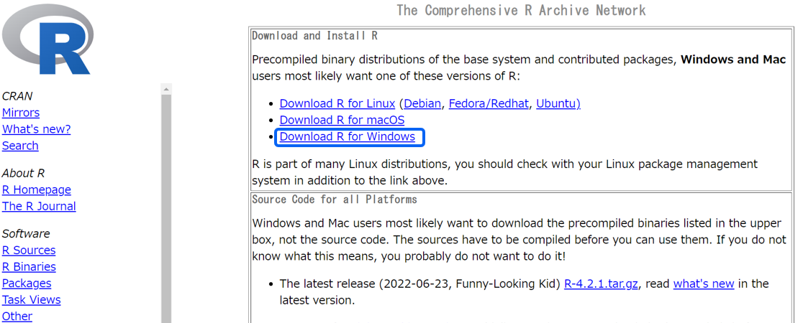

3. baseをクリック

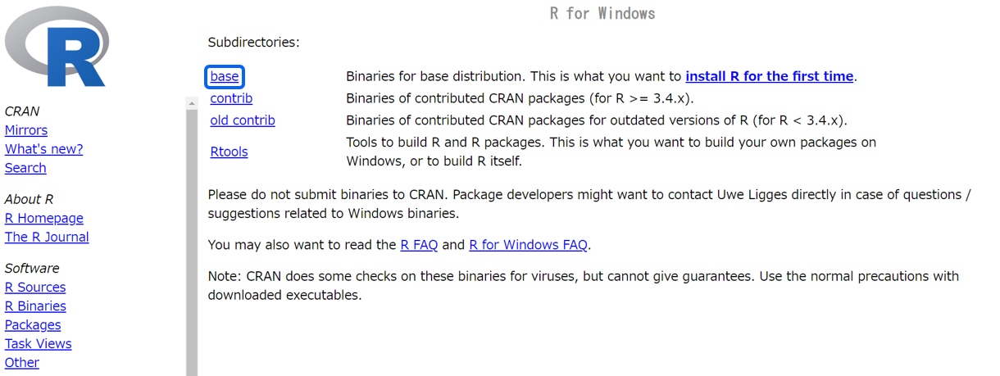

4. Download R-X.X.X for Windowsをクリック

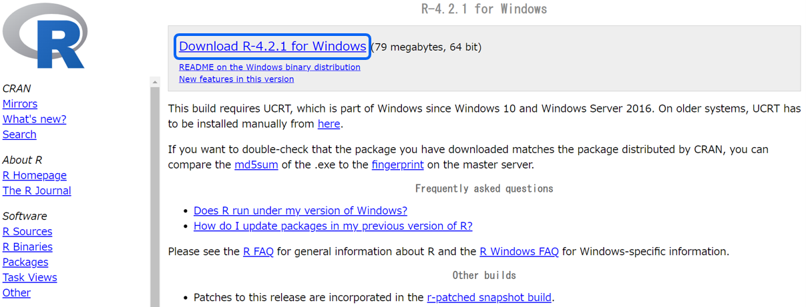

5. ダウンロードしたファイル（R-X.X.X-win）をダブルクリックし，次へをクリックしていく（特別な事情がなければデフォルトの設定のままでよい）

### バージョンアップ／ダウン

1. 「インストール」と同様の手順でインストール

2. ToolsをクリックしてGlobal Optionsをクリック

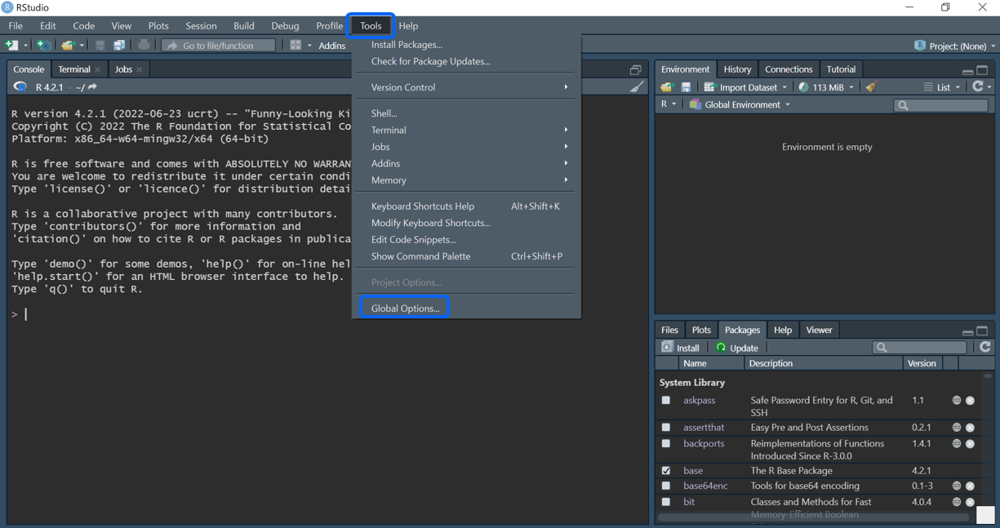

3. Changeをクリック

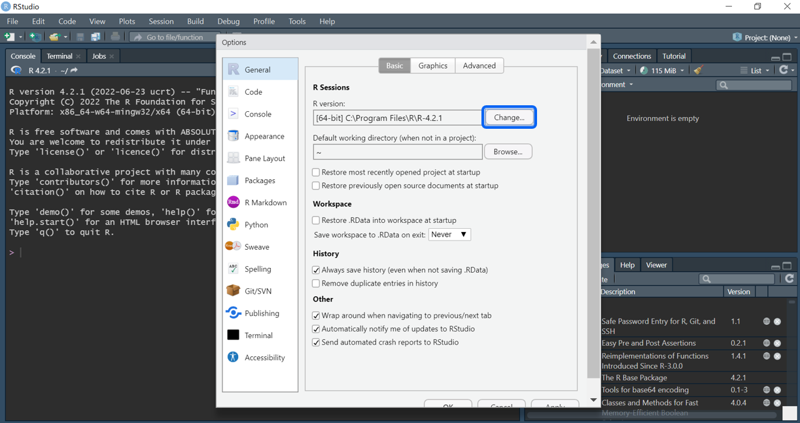

4. 最新のバージョンを選択してOKをクリックしてさらにOKをクリック

バージョンダウンさせたければ，ここで古いバージョンを選択する

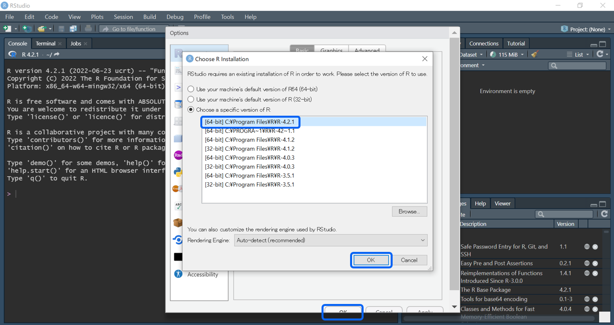

5. コンソールで`R.version`と打ち，バージョンを確認

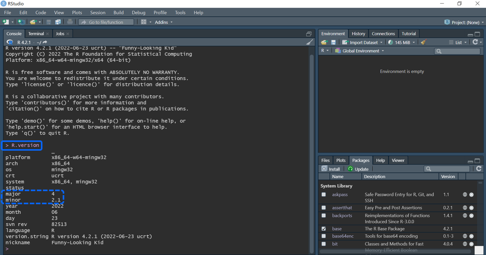

6. 反映されていなければ，一度RStudioを起動し直す

## RStudio

### インストール

* Rをインストールしてから

1. [Download the RStudio IDE](https://www.rstudio.com/products/rstudio/download/)をクリック

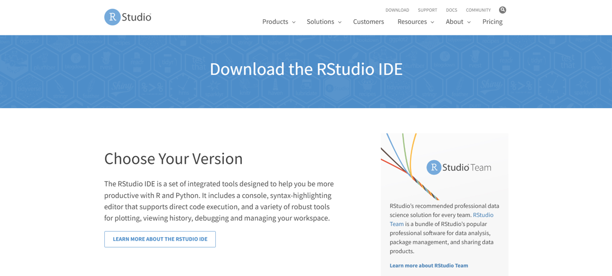

2. スクロールしてAll Installersから"Windows X"の"RStudio-XXXX.XX.x-XXX.exe"をクリック

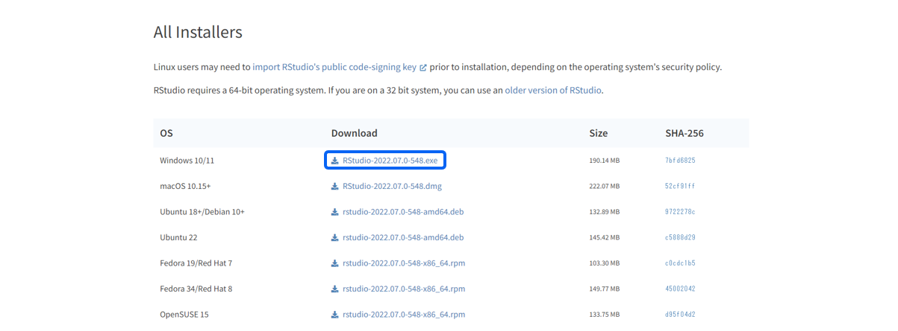

3. ダウンロードされたファイルをダブルクリックし，次へをクリックしていく（特別な事情がなければデフォルトの設定のままでよい）

### ワークスペースの設定

1. ToolsをクリックしてGlobal optionsをクリック


2. Workspaceの"Restore .RData into workspace at startup"にチェックが入っていたらチェックを外す

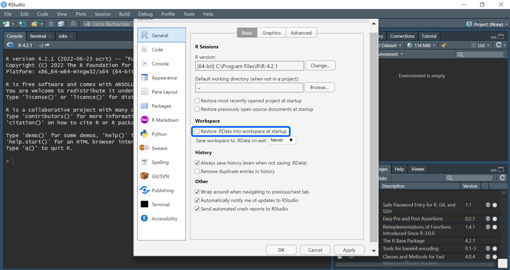

3. 同じWorkspaceの"Save workspace to .RData on exit"が"Never"になっていなければ"Never"にしてOKをクリック

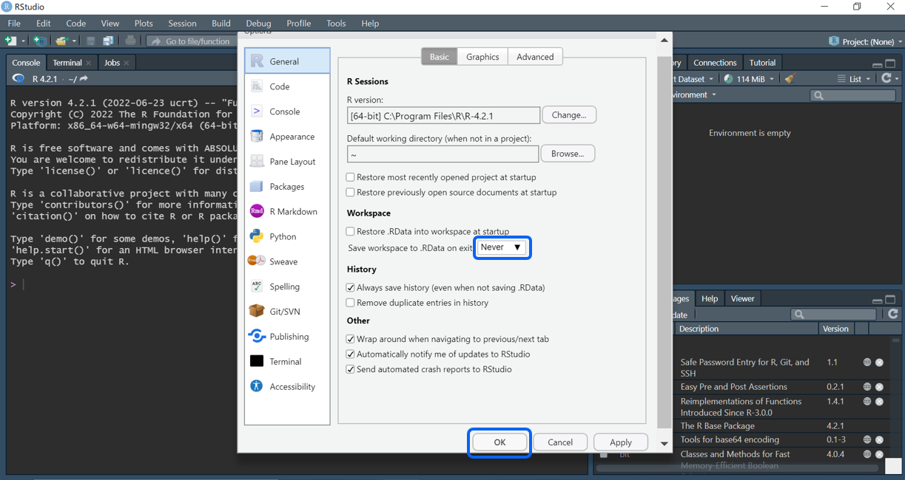

### 文字コードの設定

1. ToolsをクリックしてGlobal optionsをクリック


2. CodeをクリックしてSavingをクリックしてDefault text encodingで"UTF-8"を選択してOKをクリック

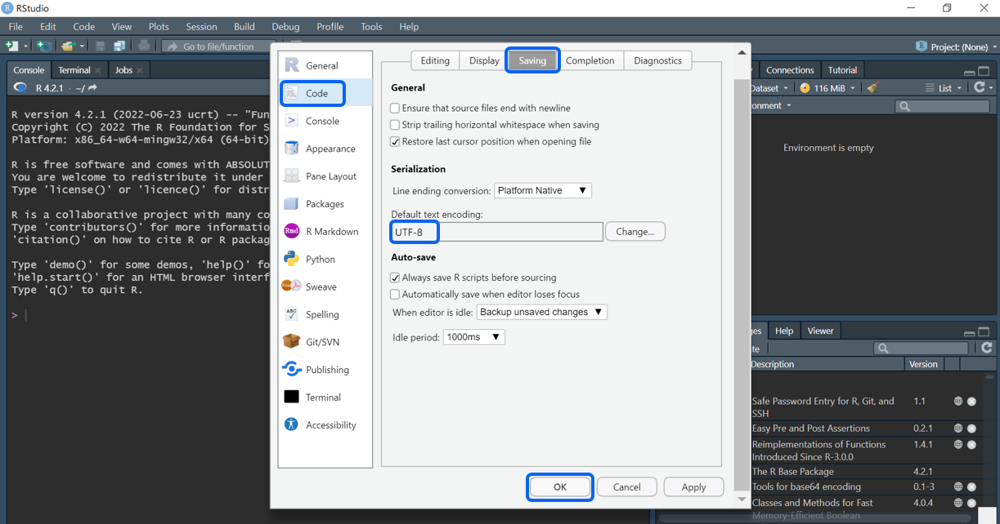

### プロジェクトの使い方

* GitHubと連携する場合は，[GitHub-tips](ron0128.github.io/github-tips/)の"RStudioの設定"にプロジェクトの設定方法を記載しているので，そちらをご参照ください。

1. ProjectをクリックしてNew Projectをクリック

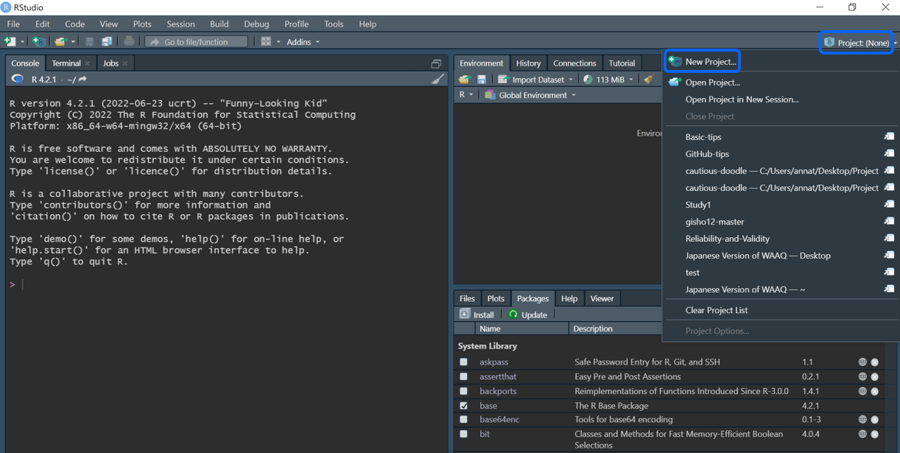

2. New Directoryをクリック

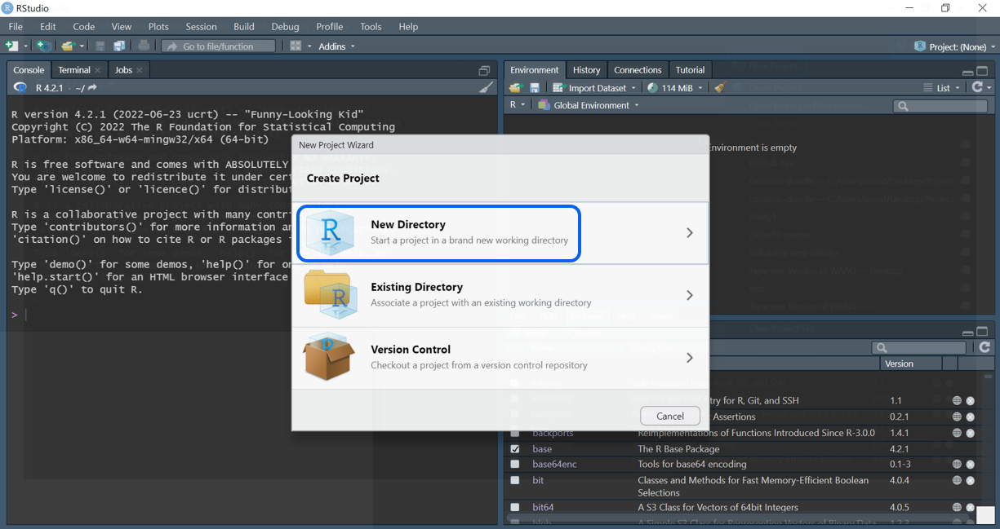

3. New Projectをクリック

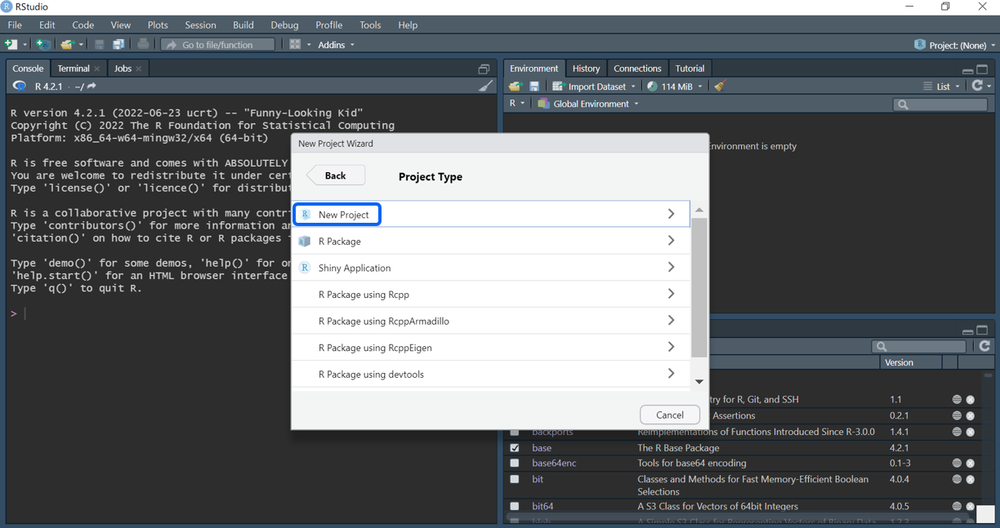

4. Directory nameにプロジェクト名を入力

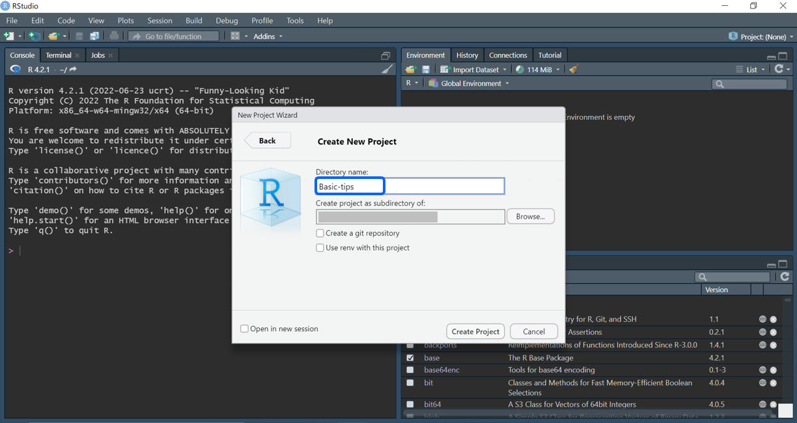

5. Create project as subdirectory ofにプロジェクトを作りたい場所を指定してCreate Projectをクリック

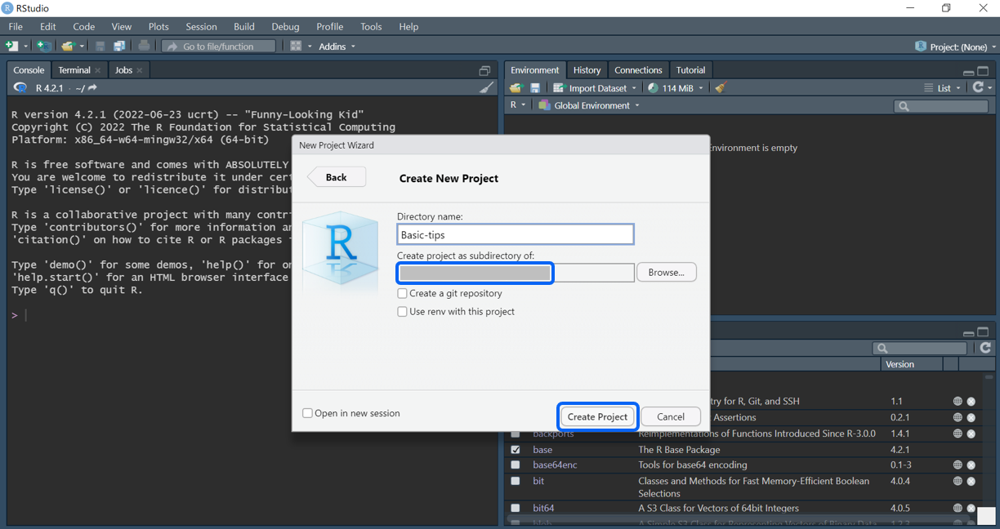


# パッケージの読み込み

* 起動するたびにパッケージを読み込む必要がある

* パッケージをインストールしていなければ`install.packages("tidyverse")`でインストール

## パッケージを読み込み

```{r}
library(tidyverse)
library(palmerpenguins) # サンプルデータ
```


# データの読み込み（Import）

## csvファイルを読み込む場合

* data.tableパッケージのfread関数
  + freadはRの文字コードに依存する
  + いまはRの文字コードがUTF-8になったので，UTF-8で作られたcsvであれば読み込める
  + cp932で作られたcsvは読み込めない 
  + tibble型にはならない
  + [data.table: Extension of 'data.frame'](https://cran.r-project.org/web/packages/data.table/index.html)

* vroomパッケージのvroom関数（推奨）
  + vroomは文字コードを指定することができる
  + UTF-8がデフォルトのため，UTF-8で作られたcsvであれば引数なしに読み込める
  + cp932で作られたcsvは引数`locale = locale(encoding = "cp932")`を指定すれば読み込める
  + tibble型になる
  + [vroom: Read and Write Rectangular Text Data Quickly](https://cran.r-project.org/web/packages/vroom/index.html)

```{r eval=FALSE}
# fread（UTF-8）
# tibble型になっていないのでas_tibble()でtibble型にする
df <- 
  data.table::fread(".csv",
                    data.table = FALSE) |> 
  as_tibble()

# vroom（UTF-8）
df <- 
  vroom::vroom(".csv")

# vroom（cp932）
df <- 
  vroom::vroom(".csv",
               locale = locale(encoding = "cp932"))
```

## Excelファイルを読み込む場合

* readxlパッケージのread_xlsx関数
  + 文字コードは問題にならない
  + tibble型にはならない
  + [readxl: Read Excel Files](https://cran.r-project.org/web/packages/readxl/index.html)

```{r eval=FALSE}
df <- 
  readxl::read_xlsx(".xlsx") |> 
  as_tibble()

# シートを指定したいときはsheet引数を使う
df <- 
  read_xlsx(".xlsx", 
            sheet = "") |> 
  as_tibble()
```


# データ変換（Data transformation）

* サンプルデータの内容（palmerpenguinsパッケージのpenguinsデータ）
  + 8変数344観測値のデータ
  + species: ペンギンの種を表す因子型の変数（アデリー，ヒゲ，ジェンツー）
  + island: 南極パーマー諸島の島を表す因子型の変数（ビスコー諸島，ドリーム島，トージャーセン島）
  + bill_length_mm: くちばしの長さを表す実数型の変数（mm）
  + bill_depth_mm: くちばしの厚さを表す実数型の変数（mm）
  + flipper_length_mm: 翼の長さを表す整数型の変数（mm）
  + body_mass_g: 体重を表す整数型の変数（グラム）
  + sex: 性別を表す因子型の変数（オス，メス）
  + year: 調査年を表す整数型の変数（2007年，2008年，2009年）
  + [palmerpenguins: Palmer Archipelago (Antarctica) Penguin Data](https://cloud.r-project.org/web/packages/palmerpenguins/index.html)
  
```{r}
penguins
```

## 行

* [R for Data Science（2e）](https://r4ds.hadley.nz/)を参照して作成

* "## パッケージを読み込み"を実行してから

### ケースを選択する（filter）

#### 条件をひとつ指定{.tabset}

##### 選択{-}

* `==`（等しい），`>=`（以上），`>`（超），`<=`（以下），`<`（未満）などが使える

```{r}
# "species"が"Adelie"のケースを選択する
# count()で"species"を確認
penguins |> 
  filter(species == "Adelie") |> 
  count(species)

# "bill_length_mm"が"35以上"のケースを選択する
# count()で"bill_length_mm"を確認
penguins |> 
  filter(bill_length_mm >= 35) |> 
  count(bill_length_mm)

# "bill_length_mm"が"35超"のケースを選択する
# count()で"bill_length_mm"を確認
penguins |> 
  filter(bill_length_mm > 35) |> 
  count(bill_length_mm)

# "bill_depth_mm"が"14以下"のケースを選択する
# count()で"bill_depth_mm"を確認
penguins |> 
  filter(bill_depth_mm <= 14) |> 
  count(bill_depth_mm)

# "bill_depth_mm"が"35超"のケースを選択する
# count()で"bill_depth_mm"を確認
penguins |> 
  filter(bill_depth_mm < 14) |> 
  count(bill_depth_mm)
```

##### 選択しない{-}

* `==`（等しい），`>=`（以上），`>`（超），`<=`（以下），`<`（未満）などが使える

* `!=`でfilterするとNAも削除されることに注意（詳細は後述）

```{r}
# "species"が"Adelie"のケースを選択しない
# count()で"species"を確認
penguins |> 
  filter(species != "Adelie") |> 
  count(species)

# "bill_length_mm"が"35以上"のケースを選択しない
# count()で"bill_length_mm"を確認
penguins |> 
  filter(!(bill_length_mm >= 35)) |> 
  count(bill_length_mm)

# "bill_length_mm"が"35超"のケースを選択しない
# count()で"bill_length_mm"を確認
penguins |> 
  filter(!(bill_length_mm > 35)) |> 
  count(bill_length_mm)

# "bill_depth_mm"が"14以下"のケースを選択しない
# count()で"bill_depth_mm"を確認
penguins |> 
  filter(!(bill_depth_mm <= 14)) |> 
  count(bill_depth_mm)

# "bill_depth_mm"が"35超"のケースを選択しない
# count()で"bill_depth_mm"を確認
penguins |> 
  filter(!(bill_depth_mm < 14)) |> 
  count(bill_depth_mm)
```

#### 条件を複数指定{.tabset}

##### 選択{-}

* `&`（および），`|`（または）などが使える

* `|`のショートカットに`%in%`がある

```{r}
# "species"が"Adelie"で"island"が"Biscoe"のケースを選択する
# count()で"species"と"island"を確認
penguins |> 
  filter(species == "Adelie" & island == "Biscoe") |> 
  count(species, island)

# "species"が"Adelie"または"Chinstrap"のケースを選択する
# count()で"species"を確認

# | 
penguins |> 
  filter(species == "Adelie" | species == "Chinstrap") |> 
  count(species)

# %in% 
penguins |> 
  filter(species %in% c("Adelie", "Chinstrap")) |> 
  count(species)
```

##### 選択しない{-}

* `&`（および），`|`（または）などが使える

* `|`のショートカットに`%in%`がある

```{r}
# "species"が"Adelie"で"island"が"Biscoe"のケースを選択しない
# count()で"species"と"island"を確認
penguins |> 
  filter(!(species == "Adelie" & island == "Biscoe")) |> 
  count(species, island)

# "species"が"Adelie"または"Chinstrap"のケースを選択しない
# count()で"species"を確認

# | 
penguins |> 
  filter(!(species == "Adelie" | species == "Chinstrap")) |> 
  count(species)

# %in% 
penguins |> 
  filter(!species %in% c("Adelie", "Chinstrap")) |> 
  count(species)
```

#### 水準の条件を指定{.tabset}

##### 選択する{-}

```{r}
# "fruit"の変数を追加したオブジェクトを作成
df <- 
  tribble(
    ~fruit, 
      "apple",
      "banana",
      "melon",
      "strawberry",
      "orange",
      "peach",
      "green apple")

df

# "fruit"の中で"apple"という文字を含むケースを選択する
df |> 
  filter(str_detect(fruit, "apple"))

# "fruit"の中で"apple"という文字を含むケースを選択しない
df |> 
  filter(!str_detect(fruit, "apple"))
```

##### 選択しない{-}

```{r}
# "fruit"の中で"apple"という文字を含むケースを選択しない
df |> 
  filter(!str_detect(fruit, "apple"))
```

#### != を使うときの注意

* `filter(sex != "male")"`でfilterするとNAも削除される

* `filter(!sex %in% c("male"))"`でfilterすればNAは削除されない

```{r}
# "sex"には"female"，"male"，"NA"が入っている
penguins |> 
  count(sex)

# "sex != male"として"male"を選択しないようにする
# count()で"sex"を確認
# "NA"も除外されていて"female"のみが選択される
penguins |> 
  filter(sex != "male") |> 
  count(sex)

# "NA"を除外せず"male"だけを選択しないようにする
# count()で"sex"を確認
# "female"と"NA"が選択される
penguins |> 
  filter(!sex %in% c("male")) |> 
  count(sex)
```

#### 欠損値{.tabset}

##### 選択する{-}

```{r}
# "sexがNAのケースを選択する
# count()で"sex"を確認
penguins |>
  filter(is.na(sex)) |> 
  count(sex)
```

##### 選択しない{-}

* `drop_na`と`filter(!is.na)`を使う方法がある

* ひとつの変数を扱う場合であればどちらも同じだが，複数の変数を扱う場合は`drop_na`のほうが便利そう

```{r}
# drop_na ----------

## "sexがNAのケースを選択しない
## count()で"sex"を確認
penguins |> 
  drop_na(sex) |> 
  count(sex)

## 複数の変数の欠損を除く
## filter(is.na)で"sex"の欠損または"bill_length_mm"の欠損を確認
penguins |> 
  drop_na(sex, bill_length_mm) |> 
  filter(is.na(sex) | is.na(bill_length_mm))

# filter(!is.na) ----------

## "sexがNAのケースを選択しない
## count()で"sex"を確認
penguins |>
  filter(!is.na(sex)) |> 
  count(sex)

## 複数の変数の欠損を除く
## filter(is.na)で"sex"の欠損または"bill_length_mm"の欠損を確認
penguins |>
  filter(!is.na(sex), !is.na(bill_length_mm)) |> 
  filter(is.na(sex) | is.na(bill_length_mm))
```

### ケースを並び替える（arrange）{.tabset}

#### 昇順{-}

```{r}
# "bill_length_mm"を昇順に並び替える
# select()で"bill_length_mm"を確認
penguins |> 
  arrange(bill_length_mm) |> 
  select(bill_length_mm)
```

#### 降順{-}

```{r}
# "bill_length_mm"を降順に並び替える
# select()で"bill_length_mm"を確認
penguins |> 
  arrange(desc(bill_length_mm)) |> 
  select(bill_length_mm)
```

## 列

* [R for Data Science（2e）](https://r4ds.hadley.nz/)を参照して作成

* "## パッケージを読み込み"を実行してから

### 変数を選択する（select）

* `matches()`を用いた正規表現の詳細は別の章

#### 変数をひとつ指定{.tabset}

##### 選択{-}

```{r}
# "species"を選択する
penguins |> 
  select(species)
```

##### 選択しない{-}

```{r}
# "species"を選択しない
penguins |> 
  select(!species)
```

#### 変数を個別に複数指定{.tabset}

##### 選択する{-}

```{r}
# "species"，"island"，"year"を選択する
penguins |> 
  select(species, island, year)
```

##### 選択しない{-}

```{r}
# "species"，"island"，"year"を選択しない
penguins |> 
  select(!c(species, island, year))
```

#### 変数を連続で複数指定{.tabset}

##### 選択する{-}

```{r}
# "species"から"bill_length_mm"を選択する
penguins |> 
  select(species:bill_length_mm)
```

##### 選択しない{-}

```{r}
# "species"から"bill_length_mm"を選択しない
penguins |> 
  select(!species:bill_length_mm)
```

#### 変数をまとめて複数指定{.tabset}

##### 選択する{-}

```{r}
# "species"，"year"をまとめて選択する

# "species"，"year"を含むオブジェクトを作成
obs <- 
  c("species", "year")

# all_of
penguins |> 
  select(all_of(obs))

# any_of
penguins |> 
  select(any_of(obs))
```

##### 選択しない{-}

```{r}
# "species"，"year"をまとめて選択しない

# "species"，"year"を含むオブジェクトを作成
obs <- 
  c("species", "year")

# all_of
penguins |> 
  select(!all_of(obs))

# any_of
penguins |> 
  select(!any_of(obs))
```

##### （参考）all_ofとany_ofの違い{-}

```{r eval=FALSE}
# ペンギンデータに含まれていない"weight"が入ったobsを作成
obs <- 
  c("species", "year", "weight")

# all_ofを使うと"weight"がないためエラーになる
penguins |> 
  select(all_of(obs))

# any_ofを使うと"weight"がなくともエラーにならない
penguins |> 
  select(any_of(obs))
```

#### 特定の文字で始まる変数を指定{.tabset}

##### 選択する{-}

```{r}
# "bill"で始まる変数を選択する

# starts_with
penguins |> 
  select(starts_with("bill"))

# matches
penguins |> 
  select(matches("^bill"))
```

##### 選択しない{-}

```{r}
# "bill"で始まる変数を選択しない

# starts_with
penguins |> 
  select(!starts_with("bill"))

# matches
penguins |> 
  select(!matches("^bill"))
```

#### 特定の文字で終わる変数を指定{.tabset}

##### 選択する{-}

```{r}
# "mm"で終わる変数を選択する

# ends_with
penguins |> 
  select(ends_with("mm"))

# matches
penguins |> 
  select(matches("mm$"))
```

##### 選択しない{-}

```{r}
# "mm"で終わる変数を選択しない

# ends_with
penguins |> 
  select(!ends_with("mm"))

# matches
penguins |> 
  select(!matches("mm$"))
```

#### 特定の文字を含む変数を指定{.tabset}

##### 選択する{-}

```{r}
# "length"を含む変数を選択する

# contains
penguins |> 
  select(contains("length"))

# matches
penguins |> 
  select(matches("length"))
```

##### 選択しない{-}

```{r}
# "length"を含む変数を選択しない

# contains
penguins |> 
  select(!contains("length"))

# matches
penguins |> 
  select(!matches("length"))
```

#### 番号のついた変数を指定{.tabset}

##### 選択する{-}

```{r}
# x1～x6の変数を追加したオブジェクトを作成
df <- 
  tribble(
    ~x1, ~x2, ~x3, ~x4, ~x5, ~x6,
      1,   2,   3,   4,   5,   6,
      7,   8,   9,  10,  11,  12,
     13,  14,  15,  16,  17,  18)

df

# x1～x3の変数を選択する

# num_range
df |> 
  select(num_range("x", 1:3))

# matches
df |> 
  select(matches("x[1-3]"))
```

##### 選択しない{-}

```{r}
# x1～x6の変数を追加したオブジェクトを作成
df <- 
  tribble(
    ~x1, ~x2, ~x3, ~x4, ~x5, ~x6,
      1,   2,   3,   4,   5,   6,
      7,   8,   9,  10,  11,  12,
     13,  14,  15,  16,  17,  18)

df

# x1～x3の変数を選択しない

# num_range
df |> 
  select(!num_range("x", 1:3))

# matches
df |> 
  select(!matches("x[1-3]"))
```

#### 変数名を変えて選択する

* `rename()`と同じように変数名を変えられる

```{r}
# "bill_length_mm"を"kuchibashi_length_mm"に変更する
# "bill_length_mm"を"kuchibashi_length_mm"に変更する
# names()で変数名を確認
penguins |> 
  select(kuchibashi_length_mm = bill_length_mm,
         kuchibashi_depth_mm = bill_depth_mm) |> 
  names()
```

### 変数名を変える（rename）

#### 変数名をひとつずつ変える

* rename(新しい変数名 = 古い変数名)

```{r}
# "bill_length_mm"を"kuchibashi_length_mm"に変更する
# "bill_length_mm"を"kuchibashi_length_mm"に変更する
# names()で変数名を確認
penguins |> 
  rename(kuchibashi_length_mm = bill_length_mm,
         kuchibashi_depth_mm = bill_depth_mm) |> 
  names()
```

#### 条件を指定して変数名を一気に変える

```{r}
# "bill"から始まる変数のとき，"bill"を"kuchibashi"に変更する
# names()で変数名を確認
penguins |> 
  rename_with(~str_replace(., "bill", "kuchibashi"),
              starts_with("bill")) |> 
  names()

# "_mm"で終わる変数のとき，"_mm"を削除する
# names()で変数名を確認
penguins |> 
  rename_with(~str_replace(., "_mm", ""),
              ends_with("_mm")) |> 
  names()
```

#### 変数名に共通の語を一気につける

```{r}
# "sex"が"male"のとき，"bill"，"flipper"，"body"を含む変数に接頭辞"male_"をつける
# names()で変数名を確認
penguins |> 
  filter(sex == "male") |> 
  rename_with(~str_c("male_", .),
              matches("bill|flipper|body")) |> 
  names()

# "sex"が"male"のとき，"bill"，"flipper"，"body"を含む変数に接尾辞"_male"をつける
# names()で変数名を確認
penguins |> 
  filter(sex == "male") |> 
  rename_with(~str_c(., "_male"),
              matches("bill|flipper|body")) |> 
  names()
```

### 変数を追加する（mutate）

#### 変数をひとつ追加する

* デフォルトではデータセットの右側に新しく変数が追加される

```{r}
# "body_mass_kg"を新たに追加する
# "body_mass_kg"は"body_mass_g"を1000で割ったもの
# "body_mass_kg"は一番右側に作られる
# select()で"body_mass_g"と"body_mass_kg"を確認
penguins |> 
  mutate(body_mass_kg = body_mass_g / 1000) |> 
  select(body_mass_g, body_mass_kg)
```

##### 任意の変数の前に追加する

* 任意の変数の前に入れたい場合は`.before`が使える

```{r}
# ".before = 1"とすると一番目の変数の前に加わる
penguins |> 
  mutate(body_mass_kg = body_mass_g / 1000,
         .before = 1) 

# ".before = body_mass_g"とすると"body_mass_g"の前に加わる
penguins |> 
  mutate(body_mass_kg = body_mass_g / 1000,
         .before = body_mass_g) 
```

##### 任意の変数の後に追加する

* 任意の変数の後に入れたい場合は`.after`が使える

```{r}
# ".after = 1"とすると一番目の変数の後に加わる
penguins |> 
  mutate(body_mass_kg = body_mass_g / 1000,
         .after = 1) 

# ".after = body_mass_g"とすると"body_mass_g"の後に加わる
penguins |> 
  mutate(body_mass_kg = body_mass_g / 1000,
         .after = body_mass_g) 
```

##### 保持する変数を制限する

* 保持する変数を制限する場合は`keep`が使える

```{r}
# ".keep = "used""とすると使った変数のみが表示される
penguins |> 
  mutate(body_mass_kg = body_mass_g / 1000,
         .keep = "used") 
```

#### 変数を複数追加する

```{r}
# "bill_length_mm_cm"，"flipper_length_mm_cm"を新たに追加する
# "bill_length_mm_cm"は"bill_length_mm"を10で割ったもの（flipper_lengthも同じ）
# select()で"bill_length_mm"と"bill_length_mm_cm"，"flipper_length_mm"と"flipper_length_mm_cm"を確認

# c()
penguins |> 
  mutate(across(c(bill_length_mm, flipper_length_mm),
         list(cm = ~ (. / 10)))) |> 
  select(bill_length_mm, bill_length_mm_cm, flipper_length_mm, flipper_length_mm_cm)

# ends_with
penguins |> 
  mutate(across(ends_with("length_mm"),
         list(cm = ~ (. / 10)))) |> 
  select(bill_length_mm, bill_length_mm_cm, flipper_length_mm, flipper_length_mm_cm)
```

#### 2値変数をひとつ追加する

```{r}
# "body_mass_3000"を新たに追加する
# "body_mass_3000"は"body_mass_g"が"3000以上"の場合は"1"，そうでない場合は"0"のもの
# count()で"body_mass_g"と"body_mass_3000"を確認
penguins |> 
  mutate(body_mass_3000 = if_else(body_mass_g >= 3000, 1, 0)) |> 
  count(body_mass_g, body_mass_3000)
```

#### 3値以上の変数をひとつ追加する

```{r}
# "body_mass_3000"を新たに追加する
# "body_mass_3000"は"body_mass_g"が"3000以上"の場合は"1"，そうでない場合は"0"のもの
# count()で"body_mass_g"と"body_mass_3000"を確認
# "body_mass_g"がNAのものは"不明"とする
penguins |> 
  mutate(
    body_mass_range = case_when(
      body_mass_g <= 3000 ~ "～3000", 
      body_mass_g <= 4000 ~ "～4000",
      body_mass_g <= 5000 ~ "～5000",
      body_mass_g <= 6000 ~ "～6000",
      body_mass_g >= 6000 ~ "6000～",
      is.na(body_mass_g)  ~ "不明")) |> 
  count(body_mass_g, body_mass_range)
```

#### 変数の型を変更する ★要確認

* 変数の型

関数|用途
----|----|----
as.character|文字列型に変更する
as.factor|因子型に変更する
as.numeric|数値型に変更する

```{r}
# "year"を文字列型に変更する
# count()で"year"の型を確認
penguins |> 
  mutate(
    year = as.character(year)
    ) |> 
  count(year)

# "year"を因子型に変更する
# count()で"year"の型を確認
penguins |> 
  mutate(
    year = as.factor(year)
    ) |> 
  count(year)

# "year"を数値型に変更する
# count()で"year"の型を確認
penguins |> 
  mutate(
    year = as.numeric(year)
    ) |> 
  count(year)
```

#### ひとつの変数内で水準名を変更する

```{r}
# "sex"の"male"を"1"に，"female"を"2"に変更する
# count()で"sex"を確認
penguins |> 
  mutate(
    sex = fct_recode(sex, "1" = "male", 
                          "2" = "female")) |> 
  count(sex)
```

#### 他の変数を使って水準名を変更する

```{r}
# "fruit"と"color"の変数を追加したオブジェクトを作成
df <- 
  tribble(
    　~fruit,     ~color, 
     "apple",      "red", 
    "banana",   "yellow",  
     "melon",     "blue"
    )

df 

# "fruit"の"melon"の"color"を"green"に変更，それ以外の"color"はそのままとする
df |> 
  mutate(color = case_when(
    fruit == "melon" ~ "green",
    TRUE ~ color))
```

#### 水準を並び替える

```{r}
# "fruit"と"color"の変数を追加したオブジェクトを作成
df <- 
  tribble(
    　~fruit,     ~color, 
     "apple",      "red", 
    "banana",   "yellow",  
     "melon",     "blue"
    )

df

# "fruit"を"melon"，"banana"，"apple"の順に並び替える
df |> 
  mutate(fruit = fct_relevel(fruit,
                             "melon",
                             "banana",
                             "apple")) |> 
  arrange(fruit)
```

#### 逆転処理する

```{r}
# x1～x3，y1～y3の変数を追加したオブジェクトを作成
df <- 
  tribble(
    ~x1, ~x2, ~x3, ~y1, ~y2, ~y3,
      1,   2,   3,   4,   1,   2,
      3,   4,   1,   2,   3,   4,
      1,   2,   3,   4,   1,   2)

# x1～x3を逆転処理する（4件法の場合）
# count()で"x1"と逆転処理した"x1_r"を確認
df |> 
  mutate(
    across(x1:x3,
           list(r = ~(5 -.))
           )
  ) |> 
  count(x1, x1_r)
```


#### 小数点以下の処理{.tabset}

##### 小数第二位を切り捨てる{-} 

```{r}
# x1～x2の変数を追加したオブジェクトを作成
df <- 
  tribble(
      ~x1,   ~x2,
    0.123, 0.901,
    0.234, 0.890,
    0.345, 0.789,
    0.456, 0.678,
    0.567, 0.567,
    0.678, 0.456,
    0.789, 0.345,
    0.890, 0.234,
    0.901, 0.123)

# ひとつの変数で小数第二位を切り捨てる
df |> 
  mutate(x1_kirisute = trunc(x1 * 100) / 100)

# 複数の変数で小数第二位を切り捨てる
df |> 
  mutate(across(starts_with("x"),
         list(kirisute = ~trunc(. * 100) / 100)))
```

##### 小数第二位を四捨五入する{-}　★これから

* `round()`は四捨五入ではないため使用しない

```{r}

```

### 変数を要約する（summarize）

* 平均値，標準偏差，人数などを算出する

* 平均値，標準偏差などは`na.rm = TRUE`を入れないと欠損がある場合NAになってしまう

* 人数は`!is.na()`を入れることで欠損を抜いて合計する

#### ひとつの要約値をひとつの変数で算出する

```{r}
# 平均値（mean）
penguins |> 
  summarize(bill_length_mm_mean = mean(bill_length_mm, na.rm = TRUE))

# 標準偏差（sd）
penguins |> 
  summarize(bill_length_mm_sd = sd(bill_length_mm, na.rm = TRUE))

# 人数（sum）
penguins |> 
  summarize(bill_length_mm_n = sum(!is.na(bill_length_mm)))
```

#### 複数の要約値を複数の変数で算出する

```{r}
# "bill_length_mm"と"bill_depth_mm"の平均値，標準偏差，人数
penguins |> 
  summarize(across(c(bill_length_mm, bill_depth_mm),
                   list(mean = ~mean(., na.rm = TRUE),
                        sd   = ~sd(., na.rm = TRUE),
                        n    = ~sum(!is.na(.)))))
```

#### 層別に算出する

* 層別に（グループ化して）扱いたいときは`group_by()`を使う

* 層別（グループ化）を解除したいときは`ungroup()`を使う

```{r}
# "species"ごとに"bill_length_mm"と"bill_depth_mm"の平均値，標準偏差，人数
penguins |> 
  group_by(species) |> 
  summarize(across(c(bill_length_mm, bill_depth_mm),
                   list(mean = ~mean(., na.rm = TRUE),
                        sd   = ~sd(., na.rm = TRUE),
                        n    = ~sum(!is.na(.)))))
```

### データセットを縦に長くする（pivot_longer）

#### 基本形

* `cols`にはピボットする必要がある変数を入れる
 + `select()`と同じでヘルパー関数も使用可能

* `names_to`にはcolsで選んだ変数名を格納する変数名をつける
 + もとの変数名は新しい変数の値になる

* `values_to`にはcolsで選んだセルを格納する変数名をつける

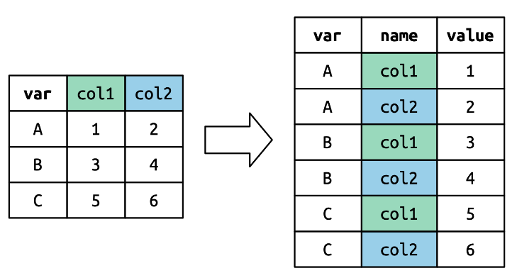

```{r}
# var，col1，col2の変数を追加したオブジェクトを作成
df <- tribble(
  ~var, ~col1, ~col2,
   "A",     1,     2,
   "B",     3,     4,
   "C",     5,     6
)

df

# col1とcol2をピボットしたいので，cols = col1:col2とする
# 選んだ変数名を"names"という名前の変数に格納したいので，names_to = "names"とする
# 選んだ変数の値を"value"という名前の変数に格納したいので，values_to = "value"とする
df |> 
  pivot_longer(
    cols = col1:col2, 
    names_to = "names", 
    values_to = "value"
  )
```

#### 変数名を分割する

##### ひとつの変数にまとめる

* `names_to`にはcolsで選んだ変数名を格納する変数名をつける
 + もとの変数名は新しい変数の値になる
 + 複数の変数名を指定できる
 
* `names_sep`には変数名を分割する区切りを入れる

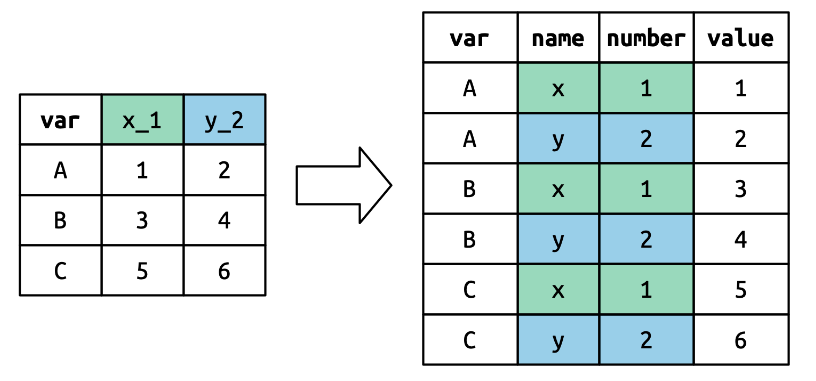

```{r}
# var，x_1，y_2の変数を追加したオブジェクトを作成
df <- tribble(
  ~var, ~x_1, ~y_2,
   "A",    1,    2,
   "B",    3,    4,
   "C",    5,    6
)

df

# var以外の変数をピボットしたいので，cols = !varとする
# 選んだ変数名を"name"，"number"という名前の変数に格納したいので，names_to = c("name", "number")とする
# 選んだ変数の値を"value"という名前の変数に格納したいので，values_to = "value"とする
df |> 
  pivot_longer(
    cols = !var, 
    names_to = c("name", "number"), 
    names_sep = "_",
    values_to = "value"
  )
```

##### もとの変数名から変数を作る

* `names_to`にはcolsで選んだ変数名を格納する変数名をつける
 + もとの変数名は新しい変数の値になる
 + 複数の変数名を指定できる
 + もとの変数名の最初のまとまりを新しい変数名として使う場合に`".value"`を使う
 
* `names_sep`には変数名を分割する区切りを入れる

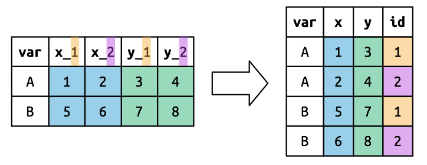

```{r}
# var，x_1，x_2，y_1，y_2の変数を追加したオブジェクトを作成
df <- tribble(
  ~var, ~x_1, ~x_2, ~y_1, ~y_2,
   "A",    1,    2,    3,    4,
   "B",    5,    6,    7,    8
)

df

# var以外の変数をピボットしたいので，cols = !varとする
# 選んだ変数名のうち"x_1"か"x_2"ならば"x"，"y_1"か"y_2"ならば"y"という名前の変数に格納したいので，names_toに".value"を入れる
# 加えて"x_1"か"y_1"ならば"1"，"x_2"か"y_2"ならば"2"を"id"という名前の変数に格納したいので，names_toに"id"も入れる
# 選んだ変数の値を"value"という名前の変数に格納したいので，values_to = "value"とする
df |> 
  pivot_longer(
    cols = !var, 
    names_to = c(".value", "id"), 
    names_sep = "_"
    ) |> 
  select(var, x:y, id)
```

#### 変数名をもっと自由に分割する　★作成中

* `names_pattern`で変数名を自由に分割できる

```{r}
# var，x_1，x_2，y_1，y_2の変数を追加したオブジェクトを作成
df <- tribble(
  ~var, ~x_1, ~x_2, ~y_1, ~y_2,
   "A",    1,    2,    3,    4,
   "B",    5,    6,    7,    8
)

df

df |> 
  pivot_longer(
    cols = !var, 
    names_prefix = "x_|y_"
    ) 
```

#### 各変数名の先頭から指定の文字を削除

* `names_prefix`で指定の文字を削除できる

```{r}
# var，x_1，x_2，y_1，y_2の変数を追加したオブジェクトを作成
df <- tribble(
  ~var, ~x_1, ~x_2, ~y_1, ~y_2,
   "A",    1,    2,    3,    4,
   "B",    5,    6,    7,    8
)

df

df |> 
  pivot_longer(
    cols = !var, 
    names_prefix = "x_|y_"
    ) 
```

#### 欠損ケースを除外する 

```{r}
# var，x_1，x_2，y_1，y_2の変数を追加したオブジェクトを作成
# varが"C"のケースは，すべての変数が欠損している
df <- tribble(
  ~var, ~x_1, ~x_2, ~y_1, ~y_2,
   "A",    1,    2,    3,    4,
   "B",    5,    6,    7,    8,
   "C",   NA,   NA,   NA,   NA
)

df

# values_drop_naを入れない場合
df |> 
  pivot_longer(
    cols = !var, 
    names_to = c(".value", "id"), 
    names_sep = "_")

# values_drop_naを入れた場合
df |> 
  pivot_longer(
    cols = !var, 
    names_to = c(".value", "id"), 
    names_sep = "_",
    values_drop_na = TRUE)
```

### データセットを横に広くする（pivot_wider）

# ショートカット

# 引用文献

```{r}

```