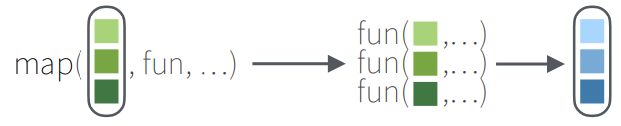

```{r setup, include=FALSE}
knitr::opts_chunk$set(
	echo = TRUE,
	fig.height = 8,
	fig.width = 8,
	message = FALSE,
	warning = FALSE)
```

# はじめに

* おぼえたことをがんばってめもするイッヌ
* Windows環境を想定した内容です

# 設定

## R

### インストール

1. [CRAN（The Comprehensive R Archive Network）](https://cran.ism.ac.jp/)をクリック（The Institute of Statistical Mathematics, Tokyo）

2. Download R for Windowsをクリック


3. baseをクリック


4. Download R-X.X.X for Windowsをクリック


5. ダウンロードしたファイル（R-X.X.X-win）をダブルクリックし，次へをクリックしていく（特別な事情がなければデフォルトの設定のままでよい）

### バージョンアップ／ダウン

1. 「インストール」と同様の手順でインストール

2. ToolsをクリックしてGlobal Optionsをクリック


3. Changeをクリック


4. 最新のバージョンを選択してOKをクリックしてさらにOKをクリック

バージョンダウンさせたければ，ここで古いバージョンを選択する


5. コンソールで`R.version`と打ち，バージョンを確認


6. 反映されていなければ，一度RStudioを起動し直す

## RStudio

### インストール

* Rをインストールしてから

1. [Download the RStudio IDE](https://www.rstudio.com/products/rstudio/download/)をクリック


2. スクロールしてAll Installersから"Windows X"の"RStudio-XXXX.XX.x-XXX.exe"をクリック


3. ダウンロードされたファイルをダブルクリックし，次へをクリックしていく（特別な事情がなければデフォルトの設定のままでよい）

### ワークスペースの設定

1. ToolsをクリックしてGlobal optionsをクリック


2. Workspaceの"Restore .RData into workspace at startup"にチェックが入っていたらチェックを外す


3. 同じWorkspaceの"Save workspace to .RData on exit"が"Never"になっていなければ"Never"にしてOKをクリック


### 文字コードの設定

1. ToolsをクリックしてGlobal optionsをクリック


2. CodeをクリックしてSavingをクリックしてDefault text encodingで"UTF-8"を選択してOKをクリック


### プロジェクトの使い方

* GitHubと連携する場合は，[GitHub-tips](ron0128.github.io/github-tips/)の"RStudioの設定"にプロジェクトの設定方法を記載しているので，そちらをご参照ください。

1. ProjectをクリックしてNew Projectをクリック


2. New Directoryをクリック


3. New Projectをクリック


4. Directory nameにプロジェクト名を入力


5. Create project as subdirectory ofにプロジェクトを作りたい場所を指定してCreate Projectをクリック


# パッケージの読み込み

* 起動するたびにパッケージを読み込む必要がある

* パッケージをインストールしていなければ`install.packages("tidyverse")`でインストール

## パッケージを読み込み

```{r}
library(tidyverse)
library(palmerpenguins) # サンプルデータ
```


# データの読み込み（Import）

## csvファイルを読み込む場合

* data.tableパッケージのfread関数
  + freadはRの文字コードに依存する
  + いまはRの文字コードがUTF-8になったので，UTF-8で作られたcsvであれば読み込める
  + cp932で作られたcsvは読み込めない 
  + tibble型にはならない
  + [data.table: Extension of 'data.frame'](https://cran.r-project.org/web/packages/data.table/index.html)

* vroomパッケージのvroom関数（推奨）
  + vroomは文字コードを指定することができる
  + UTF-8がデフォルトのため，UTF-8で作られたcsvであれば引数なしに読み込める
  + cp932で作られたcsvは引数`locale = locale(encoding = "cp932")`を指定すれば読み込める
  + tibble型になる
  + [vroom: Read and Write Rectangular Text Data Quickly](https://cran.r-project.org/web/packages/vroom/index.html)

```{r eval=FALSE}
# fread（UTF-8）
# tibble型になっていないのでas_tibble()でtibble型にする
df <- 
  data.table::fread(".csv",
                    data.table = FALSE) |> 
  as_tibble()

# vroom（UTF-8）
df <- 
  vroom::vroom(".csv")

# vroom（cp932）
df <- 
  vroom::vroom(".csv",
               locale = locale(encoding = "cp932"))
```

## Excelファイルを読み込む場合

* readxlパッケージのread_xlsx関数
  + 文字コードは問題にならない
  + tibble型にはならない
  + [readxl: Read Excel Files](https://cran.r-project.org/web/packages/readxl/index.html)

```{r eval=FALSE}
df <- 
  readxl::read_xlsx(".xlsx") |> 
  as_tibble()

# シートを指定したいときはsheet引数を使う
df <- 
  read_xlsx(".xlsx", 
            sheet = "") |> 
  as_tibble()
```


# データ変換（Data transformation）

* サンプルデータの内容（palmerpenguinsパッケージのpenguinsデータ）
  + 8変数344観測値のデータ
  + species: ペンギンの種を表す因子型の変数（アデリー，ヒゲ，ジェンツー）
  + island: 南極パーマー諸島の島を表す因子型の変数（ビスコー諸島，ドリーム島，トージャーセン島）
  + bill_length_mm: くちばしの長さを表す実数型の変数（mm）
  + bill_depth_mm: くちばしの厚さを表す実数型の変数（mm）
  + flipper_length_mm: 翼の長さを表す整数型の変数（mm）
  + body_mass_g: 体重を表す整数型の変数（グラム）
  + sex: 性別を表す因子型の変数（オス，メス）
  + year: 調査年を表す整数型の変数（2007年，2008年，2009年）
  + [palmerpenguins: Palmer Archipelago (Antarctica) Penguin Data](https://cloud.r-project.org/web/packages/palmerpenguins/index.html)
  
```{r}
penguins
```

## 行

* [R for Data Science（2e）](https://r4ds.hadley.nz/)を参照して作成

* "## パッケージを読み込み"を実行してから

### ケースを選択する（filter）

#### 条件をひとつ指定{.tabset}

##### 選択{-}

* `==`（等しい），`>=`（以上），`>`（超），`<=`（以下），`<`（未満）などが使える

```{r}
# "species"が"Adelie"のケースを選択する
# count()で"species"を確認
penguins |> 
  filter(species == "Adelie") |> 
  count(species)

# "bill_length_mm"が"35以上"のケースを選択する
# count()で"bill_length_mm"を確認
penguins |> 
  filter(bill_length_mm >= 35) |> 
  count(bill_length_mm)

# "bill_length_mm"が"35超"のケースを選択する
# count()で"bill_length_mm"を確認
penguins |> 
  filter(bill_length_mm > 35) |> 
  count(bill_length_mm)

# "bill_depth_mm"が"14以下"のケースを選択する
# count()で"bill_depth_mm"を確認
penguins |> 
  filter(bill_depth_mm <= 14) |> 
  count(bill_depth_mm)

# "bill_depth_mm"が"35超"のケースを選択する
# count()で"bill_depth_mm"を確認
penguins |> 
  filter(bill_depth_mm < 14) |> 
  count(bill_depth_mm)
```

##### 選択しない{-}

* `==`（等しい），`>=`（以上），`>`（超），`<=`（以下），`<`（未満）などが使える

* `!=`でfilterするとNAも削除されることに注意（詳細は後述）

```{r}
# "species"が"Adelie"のケースを選択しない
# count()で"species"を確認
penguins |> 
  filter(species != "Adelie") |> 
  count(species)

# "bill_length_mm"が"35以上"のケースを選択しない
# count()で"bill_length_mm"を確認
penguins |> 
  filter(!(bill_length_mm >= 35)) |> 
  count(bill_length_mm)

# "bill_length_mm"が"35超"のケースを選択しない
# count()で"bill_length_mm"を確認
penguins |> 
  filter(!(bill_length_mm > 35)) |> 
  count(bill_length_mm)

# "bill_depth_mm"が"14以下"のケースを選択しない
# count()で"bill_depth_mm"を確認
penguins |> 
  filter(!(bill_depth_mm <= 14)) |> 
  count(bill_depth_mm)

# "bill_depth_mm"が"35超"のケースを選択しない
# count()で"bill_depth_mm"を確認
penguins |> 
  filter(!(bill_depth_mm < 14)) |> 
  count(bill_depth_mm)
```

#### 条件を複数指定{.tabset}

##### 選択{-}

* `&`（および），`|`（または）などが使える

* `|`のショートカットに`%in%`がある

```{r}
# "species"が"Adelie"で"island"が"Biscoe"のケースを選択する
# count()で"species"と"island"を確認
penguins |> 
  filter(species == "Adelie" & island == "Biscoe") |> 
  count(species, island)

# "species"が"Adelie"または"Chinstrap"のケースを選択する
# count()で"species"を確認

# | 
penguins |> 
  filter(species == "Adelie" | species == "Chinstrap") |> 
  count(species)

# %in% 
penguins |> 
  filter(species %in% c("Adelie", "Chinstrap")) |> 
  count(species)
```

##### 選択しない{-}

* `&`（および），`|`（または）などが使える

* `|`のショートカットに`%in%`がある

```{r}
# "species"が"Adelie"で"island"が"Biscoe"のケースを選択しない
# count()で"species"と"island"を確認
penguins |> 
  filter(!(species == "Adelie" & island == "Biscoe")) |> 
  count(species, island)

# "species"が"Adelie"または"Chinstrap"のケースを選択しない
# count()で"species"を確認

# | 
penguins |> 
  filter(!(species == "Adelie" | species == "Chinstrap")) |> 
  count(species)

# %in% 
penguins |> 
  filter(!species %in% c("Adelie", "Chinstrap")) |> 
  count(species)
```

#### 条件をまとめて複数指定{.tabset}

##### 選択{-}

```{r}
# "species"が"Adelie"または"Chinstrap"のケースをまとめて選択する
# count()で"species"を確認

# "Adelie"，"Chinstrap"を含むオブジェクトを作成
obs <- 
  c("Adelie", "Chinstrap")

# %in% 
penguins |> 
  filter(species %in% obs) |> 
  count(species)
```

##### 選択しない{-}

```{r}
# "species"が"Adelie"または"Chinstrap"のケースをまとめて選択する
# count()で"species"を確認

# "Adelie"，"Chinstrap"を含むオブジェクトを作成
obs <- 
  c("Adelie", "Chinstrap")

# %in% 
penguins |> 
  filter(!species %in% obs) |> 
  count(species)
```

#### 水準の条件を指定{.tabset}

##### 選択{-}

```{r}
# "fruit"の変数を追加したオブジェクトを作成
df <- 
  tribble(
    ~fruit, 
      "apple",
      "banana",
      "melon",
      "strawberry",
      "orange",
      "peach",
      "green apple")

df

# "fruit"の中で"apple"という文字を含むケースを選択する
df |> 
  filter(str_detect(fruit, "apple"))
```

##### 選択しない{-}

```{r}
# "fruit"の中で"apple"という文字を含むケースを選択しない
df |> 
  filter(!str_detect(fruit, "apple"))
```

#### != を使うときの注意

* `filter(sex != "male")"`でfilterするとNAも削除される

* `filter(!sex %in% c("male"))"`でfilterすればNAは削除されない

```{r}
# "sex"には"female"，"male"，"NA"が入っている
penguins |> 
  count(sex)

# "sex != male"として"male"を選択しないようにする
# count()で"sex"を確認
# "NA"も除外されていて"female"のみが選択される
penguins |> 
  filter(sex != "male") |> 
  count(sex)

# "NA"を除外せず"male"だけを選択しないようにする
# count()で"sex"を確認
# "female"と"NA"が選択される
penguins |> 
  filter(!sex %in% c("male")) |> 
  count(sex)
```

#### 欠損値{.tabset}

##### 選択{-}

```{r}
# "sexがNAのケースを選択する
# count()で"sex"を確認
penguins |>
  filter(is.na(sex)) |> 
  count(sex)
```

##### 選択しない{-}

* `drop_na`と`filter(!is.na)`を使う方法がある

* ひとつの変数を扱う場合であればどちらも同じだが，複数の変数を扱う場合は`drop_na`のほうが便利そう

```{r}
# drop_na ----------

## "sexがNAのケースを選択しない
## count()で"sex"を確認
penguins |> 
  drop_na(sex) |> 
  count(sex)

## 複数の変数の欠損を除く
## filter(is.na)で"sex"の欠損または"bill_length_mm"の欠損を確認
penguins |> 
  drop_na(sex, bill_length_mm) |> 
  filter(is.na(sex) | is.na(bill_length_mm))

# filter(!is.na) ----------

## "sexがNAのケースを選択しない
## count()で"sex"を確認
penguins |>
  filter(!is.na(sex)) |> 
  count(sex)

## 複数の変数の欠損を除く
## filter(is.na)で"sex"の欠損または"bill_length_mm"の欠損を確認
penguins |>
  filter(!is.na(sex), !is.na(bill_length_mm)) |> 
  filter(is.na(sex) | is.na(bill_length_mm))
```

### ケースを並び替える（arrange）{.tabset}

#### 昇順{-}

```{r}
# "bill_length_mm"を昇順に並び替える
# select()で"bill_length_mm"を確認
penguins |> 
  arrange(bill_length_mm) |> 
  select(bill_length_mm)
```

#### 降順{-}

```{r}
# "bill_length_mm"を降順に並び替える
# select()で"bill_length_mm"を確認
penguins |> 
  arrange(desc(bill_length_mm)) |> 
  select(bill_length_mm)
```

## 列

* [R for Data Science（2e）](https://r4ds.hadley.nz/)を参照して作成

* "## パッケージを読み込み"を実行してから

### 変数を選択する（select）

* `matches()`を用いた正規表現の詳細は別の章

#### 変数をひとつ指定{.tabset}

##### 選択{-}

```{r}
# "species"を選択する
penguins |> 
  select(species)
```

##### 選択しない{-}

```{r}
# "species"を選択しない
penguins |> 
  select(!species)
```

#### 変数を個別に複数指定{.tabset}

##### 選択{-}

```{r}
# "species"，"island"，"year"を選択する
penguins |> 
  select(species, island, year)
```

##### 選択しない{-}

```{r}
# "species"，"island"，"year"を選択しない
penguins |> 
  select(!c(species, island, year))
```

#### 変数を連続で複数指定{.tabset}

##### 選択{-}

```{r}
# "species"から"bill_length_mm"を選択する
penguins |> 
  select(species:bill_length_mm)
```

##### 選択しない{-}

```{r}
# "species"から"bill_length_mm"を選択しない
penguins |> 
  select(!species:bill_length_mm)
```

#### 変数をまとめて複数指定{.tabset}

##### 選択{-}

```{r}
# "species"，"year"をまとめて選択する

# "species"，"year"を含むオブジェクトを作成
obs <- 
  c("species", "year")

# all_of
penguins |> 
  select(all_of(obs))

# any_of
penguins |> 
  select(any_of(obs))
```

##### 選択しない{-}

```{r}
# "species"，"year"をまとめて選択しない

# "species"，"year"を含むオブジェクトを作成
obs <- 
  c("species", "year")

# all_of
penguins |> 
  select(!all_of(obs))

# any_of
penguins |> 
  select(!any_of(obs))
```

##### （参考）all_ofとany_ofの違い{-}

```{r eval=FALSE}
# ペンギンデータに含まれていない"weight"が入ったobsを作成
obs <- 
  c("species", "year", "weight")

# all_ofを使うと"weight"がないためエラーになる
penguins |> 
  select(all_of(obs))

# any_ofを使うと"weight"がなくともエラーにならない
penguins |> 
  select(any_of(obs))
```

#### 特定の文字で始まる変数を指定{.tabset}

##### 選択{-}

```{r}
# "bill"で始まる変数を選択する

# starts_with
penguins |> 
  select(starts_with("bill"))

# matches
penguins |> 
  select(matches("^bill"))
```

##### 選択しない{-}

```{r}
# "bill"で始まる変数を選択しない

# starts_with
penguins |> 
  select(!starts_with("bill"))

# matches
penguins |> 
  select(!matches("^bill"))
```

#### 特定の文字で終わる変数を指定{.tabset}

##### 選択{-}

```{r}
# "mm"で終わる変数を選択する

# ends_with
penguins |> 
  select(ends_with("mm"))

# matches
penguins |> 
  select(matches("mm$"))
```

##### 選択しない{-}

```{r}
# "mm"で終わる変数を選択しない

# ends_with
penguins |> 
  select(!ends_with("mm"))

# matches
penguins |> 
  select(!matches("mm$"))
```

#### 特定の文字を含む変数を指定{.tabset}

##### 選択{-}

```{r}
# "length"を含む変数を選択する

# contains
penguins |> 
  select(contains("length"))

# matches
penguins |> 
  select(matches("length"))
```

##### 選択しない{-}

```{r}
# "length"を含む変数を選択しない

# contains
penguins |> 
  select(!contains("length"))

# matches
penguins |> 
  select(!matches("length"))
```

#### 番号のついた変数を指定{.tabset}

##### 選択{-}

```{r}
# x1～x6の変数を追加したオブジェクトを作成
df <- 
  tribble(
    ~x1, ~x2, ~x3, ~x4, ~x5, ~x6,
      1,   2,   3,   4,   5,   6,
      7,   8,   9,  10,  11,  12,
     13,  14,  15,  16,  17,  18)

df

# x1～x3の変数を選択する

# num_range
df |> 
  select(num_range("x", 1:3))

# matches
df |> 
  select(matches("x[1-3]"))
```

##### 選択しない{-}

```{r}
# x1～x6の変数を追加したオブジェクトを作成
df <- 
  tribble(
    ~x1, ~x2, ~x3, ~x4, ~x5, ~x6,
      1,   2,   3,   4,   5,   6,
      7,   8,   9,  10,  11,  12,
     13,  14,  15,  16,  17,  18)

df

# x1～x3の変数を選択しない

# num_range
df |> 
  select(!num_range("x", 1:3))

# matches
df |> 
  select(!matches("x[1-3]"))
```

#### 変数名を変えて選択する

* `rename()`と同じように変数名を変えられる

```{r}
# "bill_length_mm"を"kuchibashi_length_mm"に変更する
# "bill_length_mm"を"kuchibashi_length_mm"に変更する
# names()で変数名を確認
penguins |> 
  select(kuchibashi_length_mm = bill_length_mm,
         kuchibashi_depth_mm = bill_depth_mm) |> 
  names()
```

### 変数名を変える（rename）

#### 変数名をひとつずつ変える

* rename(新しい変数名 = 古い変数名)

```{r}
# "bill_length_mm"を"kuchibashi_length_mm"に変更する
# "bill_length_mm"を"kuchibashi_length_mm"に変更する
# names()で変数名を確認
penguins |> 
  rename(kuchibashi_length_mm = bill_length_mm,
         kuchibashi_depth_mm = bill_depth_mm) |> 
  names()
```

#### 条件を指定して変数名を一気に変える

```{r}
# "bill"から始まる変数のとき，"bill"を"kuchibashi"に変更する
# names()で変数名を確認
penguins |> 
  rename_with(~str_replace(., "bill", "kuchibashi"),
              starts_with("bill")) |> 
  names()

# "_mm"で終わる変数のとき，"_mm"を削除する
# names()で変数名を確認
penguins |> 
  rename_with(~str_replace(., "_mm", ""),
              ends_with("_mm")) |> 
  names()
```

#### 変数名に共通の語を一気につける

```{r}
# "sex"が"male"のとき，"bill"，"flipper"，"body"を含む変数に接頭辞"male_"をつける
# names()で変数名を確認
penguins |> 
  filter(sex == "male") |> 
  rename_with(~str_c("male_", .),
              matches("bill|flipper|body")) |> 
  names()

# "sex"が"male"のとき，"bill"，"flipper"，"body"を含む変数に接尾辞"_male"をつける
# names()で変数名を確認
penguins |> 
  filter(sex == "male") |> 
  rename_with(~str_c(., "_male"),
              matches("bill|flipper|body")) |> 
  names()
```

### 変数を追加する（mutate）

#### 変数をひとつ追加する

* デフォルトではデータセットの右側に新しく変数が追加される

```{r}
# "body_mass_kg"を新たに追加する
# "body_mass_kg"は"body_mass_g"を1000で割ったもの
# "body_mass_kg"は一番右側に作られる
# select()で"body_mass_g"と"body_mass_kg"を確認
penguins |> 
  mutate(body_mass_kg = body_mass_g / 1000) |> 
  select(body_mass_g, body_mass_kg)
```

##### 任意の変数の前に追加する

* 任意の変数の前に入れたい場合は`.before`が使える

```{r}
# ".before = 1"とすると一番目の変数の前に加わる
penguins |> 
  mutate(body_mass_kg = body_mass_g / 1000,
         .before = 1) 

# ".before = body_mass_g"とすると"body_mass_g"の前に加わる
penguins |> 
  mutate(body_mass_kg = body_mass_g / 1000,
         .before = body_mass_g) 
```

##### 任意の変数の後に追加する

* 任意の変数の後に入れたい場合は`.after`が使える

```{r}
# ".after = 1"とすると一番目の変数の後に加わる
penguins |> 
  mutate(body_mass_kg = body_mass_g / 1000,
         .after = 1) 

# ".after = body_mass_g"とすると"body_mass_g"の後に加わる
penguins |> 
  mutate(body_mass_kg = body_mass_g / 1000,
         .after = body_mass_g) 
```

##### 保持する変数を制限する

* 保持する変数を制限する場合は`keep`が使える

```{r}
# ".keep = "used""とすると使った変数のみが表示される
penguins |> 
  mutate(body_mass_kg = body_mass_g / 1000,
         .keep = "used") 
```

#### 変数を複数追加する

```{r}
# "bill_length_mm_cm"，"flipper_length_mm_cm"を新たに追加する
# "bill_length_mm_cm"は"bill_length_mm"を10で割ったもの（flipper_lengthも同じ）
# select()で"bill_length_mm"と"bill_length_mm_cm"，"flipper_length_mm"と"flipper_length_mm_cm"を確認

# c()
penguins |> 
  mutate(across(c(bill_length_mm, flipper_length_mm),
         list(cm = ~ (. / 10)))) |> 
  select(bill_length_mm, bill_length_mm_cm, flipper_length_mm, flipper_length_mm_cm)

# ends_with
penguins |> 
  mutate(across(ends_with("length_mm"),
         list(cm = ~ (. / 10)))) |> 
  select(bill_length_mm, bill_length_mm_cm, flipper_length_mm, flipper_length_mm_cm)
```

#### 2値変数をひとつ追加する

```{r}
# "body_mass_3000"を新たに追加する
# "body_mass_3000"は"body_mass_g"が"3000以上"の場合は"1"，そうでない場合は"0"のもの
# count()で"body_mass_g"と"body_mass_3000"を確認
penguins |> 
  mutate(body_mass_3000 = if_else(body_mass_g >= 3000, 1, 0)) |> 
  count(body_mass_g, body_mass_3000)
```

#### 3値以上の変数をひとつ追加する

```{r}
# "body_mass_3000"を新たに追加する
# "body_mass_3000"は"body_mass_g"が"3000以上"の場合は"1"，そうでない場合は"0"のもの
# count()で"body_mass_g"と"body_mass_3000"を確認
# "body_mass_g"がNAのものは"不明"とする
penguins |> 
  mutate(
    body_mass_range = case_when(
      body_mass_g <= 3000 ~ "～3000", 
      body_mass_g <= 4000 ~ "～4000",
      body_mass_g <= 5000 ~ "～5000",
      body_mass_g <= 6000 ~ "～6000",
      body_mass_g >= 6000 ~ "6000～",
      is.na(body_mass_g)  ~ "不明")) |> 
  count(body_mass_g, body_mass_range)
```

#### 変数の型を変更する ★要確認

* 変数の型

関数|用途
----|----|----
as.character|文字列型に変更する
as.factor|因子型に変更する
as.numeric|数値型に変更する

```{r}
# "year"を文字列型に変更する
# count()で"year"の型を確認
penguins |> 
  mutate(
    year = as.character(year)
    ) |> 
  count(year)

# "year"を因子型に変更する
# count()で"year"の型を確認
penguins |> 
  mutate(
    year = as.factor(year)
    ) |> 
  count(year)

# "year"を数値型に変更する
# count()で"year"の型を確認
penguins |> 
  mutate(
    year = as.numeric(year)
    ) |> 
  count(year)
```

#### ひとつの変数内で水準名を変更する

```{r}
# "sex"の"male"を"1"に，"female"を"2"に変更する
# count()で"sex"を確認
penguins |> 
  mutate(
    sex = fct_recode(sex, "1" = "male", 
                          "2" = "female")) |> 
  count(sex)
```

#### ひとつの変数内で水準名から一部の文字を削除する

```{r}
# "fruit"と"color"の変数を追加したオブジェクトを作成
df <- 
  tribble(
    　~time,
    "time1", 
    "time2",   
    "time3",  
    "time4",     
    "time5"
    )

df 

# "sex"の"male"を"1"に，"female"を"2"に変更する
# count()で"sex"を確認
df |> 
  mutate(
    time = str_replace(time, "time", "")) |> 
  count(time)
```

#### 他の変数を使って水準名を変更する

```{r}
# "fruit"と"color"の変数を追加したオブジェクトを作成
df <- 
  tribble(
    　~fruit,     ~color, 
     "apple",      "red", 
    "banana",   "yellow",  
     "melon",     "blue"
    )

df 

# "fruit"の"melon"の"color"を"green"に変更，それ以外の"color"はそのままとする
df |> 
  mutate(color = case_when(
    fruit == "melon" ~ "green",
    TRUE ~ color))
```

#### 水準を並び替える

```{r}
# "fruit"と"color"の変数を追加したオブジェクトを作成
df <- 
  tribble(
    　~fruit,     ~color, 
     "apple",      "red", 
    "banana",   "yellow",  
     "melon",     "blue"
    )

df

# "fruit"を"melon"，"banana"，"apple"の順に並び替える
df |> 
  mutate(fruit = fct_relevel(fruit,
                             "melon",
                             "banana",
                             "apple")) |> 
  arrange(fruit)
```

#### 逆転処理する

```{r}
# x1～x3，y1～y3の変数を追加したオブジェクトを作成
df <- 
  tribble(
    ~x1, ~x2, ~x3, ~y1, ~y2, ~y3,
      1,   2,   3,   4,   1,   2,
      3,   4,   1,   2,   3,   4,
      1,   2,   3,   4,   1,   2)

# x1～x3を逆転処理する（4件法の場合）
# count()で"x1"と逆転処理した"x1_r"を確認
df |> 
  mutate(
    across(x1:x3,
           list(r = ~(5 -.))
           )
  ) |> 
  count(x1, x1_r)
```


#### 小数点以下の処理{.tabset}

##### 小数第二位を切り捨てる{-} 

```{r}
# x1～x2の変数を追加したオブジェクトを作成
df <- 
  tribble(
      ~x1,   ~x2,
    0.123, 0.901,
    0.234, 0.890,
    0.345, 0.789,
    0.456, 0.678,
    0.567, 0.567,
    0.678, 0.456,
    0.789, 0.345,
    0.890, 0.234,
    0.901, 0.123)

# ひとつの変数で小数第二位を切り捨てる
df |> 
  mutate(x1_kirisute = trunc(x1 * 100) / 100)

# 複数の変数で小数第二位を切り捨てる
df |> 
  mutate(across(starts_with("x"),
         list(kirisute = ~trunc(. * 100) / 100)))
```

##### 小数第二位を四捨五入する{-}　★これから

* `round()`は四捨五入ではないため使用しない

```{r}

```

## 変数を要約する（summarize）

* 平均値，標準偏差，人数などを算出する

* 平均値，標準偏差などは`na.rm = TRUE`を入れないと欠損がある場合NAになってしまう

* 人数は`!is.na()`を入れることで欠損を抜いて合計する

### ひとつの要約値をひとつの変数で算出する

```{r}
# 平均値（mean）
penguins |> 
  summarize(bill_length_mm_mean = mean(bill_length_mm, na.rm = TRUE))

# 標準偏差（sd）
penguins |> 
  summarize(bill_length_mm_sd = sd(bill_length_mm, na.rm = TRUE))

# 人数（sum）
penguins |> 
  summarize(bill_length_mm_n = sum(!is.na(bill_length_mm)))
```

### 複数の要約値を複数の変数で算出する

```{r}
# "bill_length_mm"と"bill_depth_mm"の平均値，標準偏差，人数
penguins |> 
  summarize(across(c(bill_length_mm, bill_depth_mm),
                   list(mean = ~mean(., na.rm = TRUE),
                        sd   = ~sd(., na.rm = TRUE),
                        n    = ~sum(!is.na(.)))))
```

### 層別に算出する

* 層別に（グループ化して）扱いたいときは`group_by()`を使う

* 層別（グループ化）を解除したいときは`ungroup()`を使う

```{r}
# "species"ごとに"bill_length_mm"と"bill_depth_mm"の平均値，標準偏差，人数
penguins |> 
  group_by(species) |> 
  summarize(across(c(bill_length_mm, bill_depth_mm),
                   list(mean = ~mean(., na.rm = TRUE),
                        sd   = ~sd(., na.rm = TRUE),
                        n    = ~sum(!is.na(.)))))
```

## データセットを縦に長くする（pivot_longer）

### 基本形

* `pivot_longer(data, cols, names_to = "name", values_to = "value")`
  + （例）Figure20 `pivot_longer(cols = col1:col2, names_to = "names", values_to = "value")`
  
* `cols`にはピボットする必要がある変数を入れる
  + `select()`と同じでヘルパー関数も使用可能
  + （例）cols = col1:col2 

* `names_to`にはcolsで選んだ変数名を格納する変数名をつける
  + もとの変数名は新しい変数の値になる
  + （例）names_to = "names"    

* `values_to`にはcolsで選んだ値を格納する変数名をつける
  + （例）values_to = "value"
  


```{r}
# var，col1，col2の変数を追加したオブジェクトを作成
df <- tribble(
  ~var, ~col1, ~col2,
   "A",     1,     2,
   "B",     3,     4,
   "C",     5,     6
)

df

# col1とcol2をピボットしたいので，cols = col1:col2とする
# 選んだ変数名を"names"という名前の変数に格納したいので，names_to = "names"とする
# 選んだ変数の値を"value"という名前の変数に格納したいので，values_to = "value"とする
df |> 
  pivot_longer(
    cols = col1:col2, 
    names_to = "names", 
    values_to = "value"
  )
```

### 変数名を分割する

#### 値をひとつの変数にまとめる

* `pivot_longer(data, cols, names_to = "name", names_sep = NULL, values_to = "value")`
  + （例）Figure21 `pivot_longer(cols = !var, names_to = c("name", "number"), names_sep = "_", values_to = "value")`

* `cols`にはピボットする必要がある変数を入れる
  + `select()`と同じでヘルパー関数も使用可能
  + （例）cols = !var 
  
* `names_to`にはcolsで選んだ変数名を格納する変数名をつける
  + もとの変数名は新しい変数の値になる
  + 複数の変数名を指定できる
  + （例）names_to = c("name", "number")   
 
* `names_sep`には変数名を分割する区切りを入れる
  + （例）names_sep = "_"
  
* `values_to`にはcolsで選んだ値を格納する変数名をつける
  + （例）values_to = "value"
  


```{r}
# var，x_1，y_2の変数を追加したオブジェクトを作成
df <- tribble(
  ~var, ~x_1, ~y_2,
   "A",    1,    2,
   "B",    3,    4,
   "C",    5,    6
)

df

# var以外の変数をピボットしたいので，cols = !varとする
# 選んだ変数名を"name"，"number"という名前の変数に格納したいので，names_to = c("name", "number")とする
# 選んだ変数の値を"value"という名前の変数に格納したいので，values_to = "value"とする
df |> 
  pivot_longer(
    cols = !var, 
    names_to = c("name", "number"), 
    names_sep = "_",
    values_to = "value"
  )
```

#### もとの変数名から変数を作る

* `pivot_longer(data, cols, names_to = "name", names_sep = NULL)`
  + （例）Figure22 `pivot_longer(cols = !var, names_to = c(".value", "id"), names_sep = "_")`

* `cols`にはピボットする必要がある変数を入れる
  + `select()`と同じでヘルパー関数も使用可能
  + （例）cols = !var 
  
* `names_to`にはcolsで選んだ変数名を格納する変数名をつける
  + もとの変数名は新しい変数の値になる
  + 複数の変数名を指定できる
  + もとの変数名のまとまりを新しい変数名として使う場合に`".value"`を使う
  + （例）names_to = c(".value", "id")  
 
* `names_sep`には変数名を分割する区切りを入れる
  + （例）names_sep = "_"


```{r}
# var，x_1，x_2，y_1，y_2の変数を追加したオブジェクトを作成
df <- tribble(
  ~var, ~x_1, ~x_2, ~y_1, ~y_2,
   "A",    1,    2,    3,    4,
   "B",    5,    6,    7,    8
)

df

# var以外の変数をピボットしたいので，cols = !varとする
# 選んだ変数名のうち"x_1"か"x_2"ならば"x"，"y_1"か"y_2"ならば"y"という名前の変数に格納したいので，names_toに".value"を入れる
# 加えて"x_1"か"y_1"ならば"1"，"x_2"か"y_2"ならば"2"を"id"という名前の変数に格納したいので，names_toに"id"も入れる
df |> 
  pivot_longer(
    cols = !var, 
    names_to = c(".value", "id"), 
    names_sep = "_"
    ) |> 
  select(var, x:y, id)
```

### 変数名を自由に分割する

* `names_pattern`で変数名を自由に分割できる

* 正規表現の詳細は別の章

* 正規表現のよく使う例
  + [RStudio Cheatsheets](https://www.rstudio.com/resources/cheatsheets/)のうちString manipulation with stringr cheatsheetを参照

正規表現|用途|用例|結果
----|----|----|----
.|新しい行を除くすべての文字|"."|**abc ABC 123 .!?\(){}**
^a|文字列で始まる|"^a"|**a**aa
a\$|文字列で終わる|"a$"|aa**a**
a+|1以上|"a+"|.**a**.**aa**.**aaa**
a{n}|n|"a{2}"|.a.**aa**.**aa**a
a{n,}|n以上|"a{2,}"|.a.**aa**.**aaa**

#### 1つめのアンダーバーで分割

* ここでは1つめのアンダーバーの前が1文字のため`(.{1})_(.*)"`としている

* 2文字であれば`(.{2})_(.*)"`, 3文字以内であれば`(.{1,3})_(.*)"`などで対応できる

```{r}
# var，x_m，x_sd，x_all_percent, y_m，y_sd, y_all_percentの変数を追加したオブジェクトを作成
df <- tribble(
  ~var, ~x_m, ~x_sd, ~x_all_percent, ~y_m, ~y_sd, ~y_all_percent,
   "A",    1,    2,               3,    4,     5,              6,
   "B",    7,    8,               9,   10,    11,             12
)

df

# var以外の変数をピボットしたいので，cols = !varとする
# 選んだ変数名のうち"x_m"か"x_sd"ならば"x"，"y_1"か"y_2"ならば"y"で"item"という名前の変数に格納したいので，names_toに"item"を入れる
# 加えて"m"，"sd"，"all_percent"という名前の変数を作りたいので，names_toに".value"も入れる
# "x_m"，"x_sd"，"x_all_percent"ならば"x_"，"y_m"，"y_sd"，"y_all_percent"ならば"y_"で分割したいので，names_patternに"(.{1})_(.*)"を入れる
# "(.{1})_(.*)"とは"任意の1文字_任意の文字を0文字以上"ということを意味する

df |> 
  pivot_longer(
    cols = !var, 
    names_to = c("item", ".value"), 
    names_pattern = "(.{1})_(.*)"
    ) 
```

#### 最後のアンダーバーで分割

```{r}
# var，m_x，sd_x，all_percent_x, m_y，sd_y, all_percent_yの変数を追加したオブジェクトを作成
df <- tribble(
  ~var, ~m_x, ~sd_x, ~all_percent_x, ~m_y, ~sd_y, ~all_percent_y,
   "A",    1,    2,               3,    4,     5,              6,
   "B",    7,    8,               9,   10,    11,             12
)

df

# var以外の変数をピボットしたいので，cols = !varとする
# 選んだ変数名のうち"m_x"か"m_y"ならば"m"，"sd_x"か"sd_y"ならば"sd"，"all_percent_x"か"all_percent_y"ならば"all_percent"で"item"という名前の変数に格納したいので，names_toに"item"を入れる
# 加えて"x"，"y"という名前の変数を作りたいので，names_toに".value"も入れる
# "m_x"，"sd_x"，"all_percent_x"ならば"_x"，"m_y"，"sd_y"，"all_percent_y"ならば"_y"で分割したいので，names_patternに"(.*)_(.*)"を入れる
# "(.*)_(.*)"とは"任意の文字を0文字以上_任意の文字を0文字以上"ということを意味する

df |> 
  pivot_longer(
    cols = !var, 
    names_to = c("item", ".value"), 
    names_pattern = "(.*)_(.*)"
    ) 
```

### 各変数名の先頭から指定の文字を削除

* `names_prefix`で指定の文字を削除できる

```{r}
# var，x_1，x_2，y_1，y_2の変数を追加したオブジェクトを作成
df <- tribble(
  ~var, ~x_1, ~x_2, ~y_1, ~y_2,
   "A",    1,    2,    3,    4,
   "B",    5,    6,    7,    8
)

df

df |> 
  pivot_longer(
    cols = !var, 
    names_prefix = "x_|y_"
    ) 
```

### 欠損ケースを除外する 

* `values_drop_na`で欠損ケースを削除できる

```{r}
# var，x_1，x_2，y_1，y_2の変数を追加したオブジェクトを作成
# varが"C"のケースは，すべての変数が欠損している
df <- tribble(
  ~var, ~x_1, ~x_2, ~y_1, ~y_2,
   "A",    1,    2,    3,    4,
   "B",    5,    6,    7,    8,
   "C",   NA,   NA,   NA,   NA
)

df

# values_drop_naを入れない場合
df |> 
  pivot_longer(
    cols = !var, 
    names_to = c(".value", "id"), 
    names_sep = "_")

# values_drop_naを入れた場合
df |> 
  pivot_longer(
    cols = !var, 
    names_to = c(".value", "id"), 
    names_sep = "_",
    values_drop_na = TRUE)
```

## データセットを横に広くする（pivot_wider）

### 基本形

* `pivot_wider(data, id_cols = NULL, names_from = name, values_from = value)`
  + （例）`pivot_wider(names_from = name, values_from = value)`

* `names_from`には新しく変数名になる変数を入れる
  + （例）names_from = name  

* `values_from`には変形したい値を入れる
  + （例）values_from = value
  
```{r}
# id，name，valueの変数を追加したオブジェクトを作成
df <- tribble(
  ~id, ~name, ~value,
   "A",  "x",      1,
   "B",  "y",      2,
   "B",  "x",      3,
　 "A",  "y",      4,
   "A",  "z",      5)

df

# "name"に入っている値を変数名にしたいので，names_from = nameとする
# "value"に入っている値を変形に使いたいので，values_from = valueとする
df |> 
  pivot_wider(
    names_from = name, 
    values_from = value
  )

# 最初からname，valueという変数であれば，names_fromとvalues_fromは省略可能
df |> 
  pivot_wider()
```

### 変数名を分割する

#### 変数を組み合わせた変数名を作る

* `pivot_wider(data, id_cols = NULL, names_from = name, values_from = value)`
  + （例）`pivot_wider(names_from = c(item, answer), values_from = percent)`

* `names_from`には新しく変数名になる変数を入れる
  + （例）names_from = c(item, answer) 

* `values_from`には変形したい値を入れる
  + （例）values_from = percent
  
```{r}
# item，answer，percentの変数を追加したオブジェクトを作成
df <- tribble(
  ~item, ~answer, ~percent,
   "A",  1,      10,
   "A",  2,      40,
   "A",  3,      40,
　 "A",  4,      10,
   "B",  1,      10,
   "B",  2,      40,
   "B",  3,      40,
   "B",  4,      10)

df

# "item"と"answer"に入っている値を変数名にしたいので，names_from = c(item, answer)とする
# "percent"に入っている値を変形に使いたいので，values_from = percentとする
df |> 
  pivot_wider(
    names_from = c(item, answer), 
    values_from = percent
  )
```

## データの連結

### 横に連結（join）

#### 連結の種類

##### 両データフレームで一致するケースと変数を保持（inner_join）

* 両データフレームで一致するケースと変数が保持される


```{r}
x <- tribble(
  ~key, ~val_x,
     1, "x1",
     2, "x2",
     3, "x3"
)

x

y <- tribble(
  ~key, ~val_y,
     1, "y1",
     2, "y2",
     4, "y3"
)

y

x |> 
  inner_join(y, by = "key")
```

##### 左のデータフレームのケースと両変数を保持（left_join）

* 左のデータフレームのケースと両変数が保持され，一致しないケースはNAになる

* 最も一般的に使用される


```{r}
x |> 
  left_join(y, by = "key")
```

##### 右のデータフレームのケースと両変数を保持（right_join）

* 右のデータフレームのケースと両変数が保持され，一致しないケースはNAになる


```{r}
x |> 
  right_join(y, by = "key")
```

##### 両データフレームのすべてのケースと変数を保持（full_join）

* 両データフレームのケースと変数が保持され，一致しないケースはNAになる


```{r}
x |> 
  full_join(y, by = "key")
```

##### 左のデータフレームに一致するケースと変数を保持（semi_join）

* 左のデータフレームのうち，右のデータフレームと一致するケースと変数が保持される


```{r}
x |> 
  semi_join(y, by = "key")
```

##### 左のデータフレームに一致しないケースと変数を保持（anti_join）

* 左のデータフレームのうち，右のデータフレームと一致しないケースと変数が保持される


```{r}
x |> 
  anti_join(y, by = "key")
```

#### キーの種類

##### 複数キーによる連結

* キーが一意ではないときは`by = c("a", "b")`と複数指定できる

```{r}
x <- tribble(
  ~key, ~key2, ~val_x,
     1,   "A",   "x1",
     2,   "A",   "x2",
     2,   "B",   "x3"
)

x

y <- tribble(
  ~key, ~key2, ~val_y,
     1,   "A",   "y1",
     2,   "A",   "y2",
     2,   "C",   "y3"
)

x |> 
  left_join(y, by = c("key", "key2"))
```

##### 異なる名前のキーによる連結

* キーの名前が異なるときは`by = c("a" = "b")`と指定できる

```{r}
x <- tribble(
  ~key, ~val_x,
     1,   "x1",
     2,   "x2",
     3,   "x3"
)

x

y <- tribble(
  ~id, ~val_y,
     1,   "y1",
     2,   "y2",
     4,   "y3"
)

x |> 
  left_join(y, by = c("key" = "id"))
```

### 横に連結（bind_rows）

```{r}
x <- tribble(
  ~key, ~val_x,
     1,   "x1",
     2,   "x2",
     3,   "x3"
)

x

y <- tribble(
  ~key, ~val_x,
     4,   "y1",
     5,   "y2",
     6,   "y3"
)

x |> 
  bind_rows(y)
```

## 日付

### 日付型を作成する

```{r}
# "period"の変数を追加したオブジェクトを作成
df <- 
  tribble(
    ~var, ~period,
    "A", "2020/1/1~2020/1/31", 
    "B", "2020/1/1~2020/3/31",
    "C", "2020/4/1~2020/5/31",  
    "D", "2020/6/1~2020/10/31")

# "period"を"period_from"と"period_to"の2つの日付変数に分割
# remove = FALSEを入れることで他の変数も保持される
df <- 
  df |> 
  separate(period,
           into = c("period_from", "period_to"),
           sep = "~",
           remove = FALSE)

# "period_from"と"period_to"を日付型に変更
df <- 
  df |> 
  mutate(across(starts_with("period_"),
                ~lubridate::ymd(.)))

# period_fromが2020/4/1以降に絞る
df |> 
  filter(period_from >= "2020/4/1")
```

## 繰り返し処理（map）

* 繰り返し処理
  + [RStudio Cheatsheets](https://www.rstudio.com/resources/cheatsheets/)のうちApply functions with purrr cheatsheetを参照

### 基礎

#### 1つのリスト

* `map(.x, .f, …)`はリストまたはベクトルの各要素に関数を適用してリストを返す



##### 基本形

```{r}
# "a"，"b"のベクトルの入った"x"，“c”，"d"のベクトルの入った"y"からなるリストを作成
l1 <- 
  list(x = c("a", "b"), 
       y = c("c", "d"))

l1

# リストの各要素をアルファベット降順に並び替える
map(l1, sort, decreasing = TRUE)
```

##### さまざまなタイプ

* 結果の型を指定できる

関数|用途
----|----|----
map_dbl(.x, .f, …)|実数型で返す
map_int(.x, .f, ...)|整数型で返す
map_chr(.x, .f, …)|文字列型で返す
map_lgl(.x, .f, …)|論理型で返す
map_dfc(.x, .f, ...)|列結合で作成されたデータフレームを返す
map_dfr(.x, .f, ..., .id = NULL)|行結合で作成されたデータフレームを返す

```{r}
# 1～10のベクトル，11～20のベクトル，21～30のベクトルからなるリストを作成
x <- 
  list(1:10, 11:20, 21:30)

x

# 実数型で返す
map_dbl(x, mean)

# 整数型で返す
map_int(x, length)

# 文字列型で返す
map_chr(l1, paste, collapse = "")

# 論理型で返す
map_lgl(x, is.integer)

# 列結合で作成されたデータフレームを返す
map_dfc(l1, rep, 3)

# 行結合で作成されたデータフレームを返す
map_dfr(x, summary)
```

#### 2つのリスト

* `map2(.x, .y, .f, …)`は2つのリストまたはベクトルの要素のペアに関数を適用してリストを返す

* map2()のように引数が2つある関数では`~ .x .y`を使用する


##### 基本形

```{r}
# "y"，"z"，"l2"のリストを作成
y <- list(1, 2, 3); z <- list(4, 5, 6); l2 <- list(x = "a", y = "z")

y

z

l2

# 各リストの各要素に第一引数*第二引数を適用する
# map2()のように引数が2つある関数では~ .x .y を使用
map2(x, y, ~ .x * .y)
```

#### 複数のリスト

* `pmap(.l, .f, …)`はリストまたはベクトルのリストから要素のグループに関数を適用してリストを返す

* pmap()のように引数が複数ある関数では`~ ..1 ..2 ..3`を使用する


##### 基本形

```{r}
# リストの各要素に第一引数*(第二引数+第三引数)を適用する
# pmap()のように引数が複数ある関数では~ ..1 ..2 ..3を使用
pmap(list(x, y, z), ~ ..1 * (..2 + ..3))
```

### 応用

#### ★作成中

## その他

### 重複

#### 重複を見つける

```{r}
# "fruit"と"color"の変数を追加したオブジェクトを作成
df <- 
  tribble(
    ~fruit,     ~color, 
    "apple",      "red", 
    "banana",  "yellow",  
    "melon",    "green",
    "apple",    "green",
    "banana",  "yellow",
    "apple",    "blue")

df 

# get_dupes()の中に変数を指定しない場合，すべての変数を使って重複を見つける
# "banana"が2ケース重複している
# 重複していないケースは返ってこない
df |> 
  janitor::get_dupes()

# get_dupes()の中に変数を指定する場合，指定した変数を使って重複を見つける
# "apple"が3ケース，"banana"が2ケース重複している
# 重複していないケースは返ってこない
df |> 
  janitor::get_dupes(fruit)
```

#### 重複を削除する

```{r}
# "fruit"と"color"の変数を追加したオブジェクトを作成
df <- 
  tribble(
    ~fruit,     ~color, 
    "apple",      "red", 
    "banana",  "yellow",  
    "melon",    "green",
    "apple",    "green",
    "banana",  "yellow",
    "apple",    "blue")

df 

# "apple"，"banana"の重複を削除
df |> 
  distinct()

# distinct()の中に変数を指定しない場合，すべての変数を使って重複を削除する
# "banana"の重複が削除
df |> 
  distinct()

# distinct()の中に変数を指定する場合，指定した変数を使って重複を削除する
# "apple"の重複，"banana"の重複が削除
# .keep_all = TRUEを入れることで他の変数も保持される
df |> 
  distinct(fruit, .keep_all = TRUE)
```

## 論理ベクトル

### ひとつの条件（if_else）

* ある値のときにa，そうでないときにbと条件指定したい場合は`if_else`が使える

#### 連続量

```{r}
# "flag"変数に"bill_length_mm"が"35以上"のときに1，そうでないときに0を入れる
# count()で"bill_length_mm"と"flag"を確認
# print()で20行目まで確認
penguins |> 
  mutate(flag = if_else(bill_length_mm >= 35, 1, 0)) |> 
  count(bill_length_mm, flag) |> 
  print(n = 20)
```

#### 欠損

```{r}
# var，xの変数を追加したオブジェクトを作成
df <- tribble(
  ~var,   ~x, 
   "A","yes",  
   "B",   NA,
   "C","yes",
   "D",   NA
)

df

# "flag"変数に"x"が"yes"のときに1，欠損のときに0を入れる
df |> 
  mutate(flag = if_else(is.na(x), 0, 1))
```

### 複数の条件（case_when）

* ある値のときにa，ある値のときにb，ある値のときにcと条件指定したい場合は`case_when`が使える

#### 連続量

```{r}
# "flag"変数に"bill_length_mm"が"50以上"のときに"50-"，40以上のときに"40-50"，30以上のときに"30-40"を入れる
# count()で"bill_length_mm"と"flag"を確認
penguins |> 
  mutate(flag = case_when(bill_length_mm >= 50 ~ "50-",
                          bill_length_mm >= 40 ~ "40-50",
                          bill_length_mm >= 30 ~ "30-40")) |> 
  count(bill_length_mm, flag)

# "flag"変数に"bill_length_mm"が"50以上"のときに"50-"，40以上のときに"40-50"，30以上のときに"30-40"を入れる
# count()で"bill_length_mm"と"flag"を確認
penguins |> 
  mutate(flag = case_when(bill_length_mm >= 50 ~ "50-",
                          bill_length_mm >= 40 ~ "40-50",
                          bill_length_mm >= 30 ~ "30-40")) |> 
  count(bill_length_mm, flag)
```

#### 一部のみ

```{r}
# "fruit"の変数を追加したオブジェクトを作成
df <- 
  tribble(
    ~fruit, 
      "apple",
      "banana",
      "melon",
      "strawberry",
      "orange",
      "peach",
      "green apple")

df

# "new_fruit"変数に"fruit"が"green apple"のときに"apple"，それ以外は"fruit"を入れる
df |> 
  mutate(new_fruit = case_when(fruit == "green apple" ~ "apple", 
                               TRUE ~ fruit))
```

## 正規表現

* 正規表現
  + [RStudio Cheatsheets](https://www.rstudio.com/resources/cheatsheets/)のうちString manipulation with stringr cheatsheetを参照

### 文字列の一致（MATCH CHARACTERS）

#### 準備

```{r}
library(stringr)

sample_see <- c("abc ABC 123\t.!?\\(){}\n")
```

#### スペース

* any whitespace

* `\s`を使う

```{r}
# スペース
str_view_all(sample_see, "\\s")
```

#### 数字

* any digit

* `\d`を使う

```{r}
# 数字
str_view_all(sample_see, "\\d")
```

#### 文字

* any word character

* `\w`を使う

```{r}
# 文字
str_view_all(sample_see, "\\w")
```

#### 小文字

* lowercase letters

* `[:lower:]`を使う

```{r}
# 小文字
str_view_all(sample_see, "[:lower:]")
```

#### 大文字

* uppercase letters

* `[:upper:]`を使う

```{r}
# 大文字
str_view_all(sample_see, "[:upper:]")
```

#### 句読点

* punctuation

* `[:punct:]`を使う

```{r}
# 句読点
str_view_all(sample_see, "[:punct:]")
```

#### すべての文字

* every character except a new line

* `.`を使う

```{r}
# 新しい行を除くすべての文字
str_view_all(sample_see, ".")
```

### 代替構成体（ALTERNATES）

#### 準備

```{r}
sample_alt <- c("abcde")
```

#### または

* or

* `ab|d`を使う

```{r}
# "ab"または"d"がつく文字列
str_view_all(sample_alt, "ab|d")
```

#### いずれか

* one of

* `[abe]`を使う

```{r}
# "a"または"b"または"e"がつく文字列
str_view_all(sample_alt, "[abe]")
```

#### 以外

* anything but

* `[^abe]`を使う

```{r}
# "a"または"b"または"e"がつかない文字列
str_view_all(sample_alt, "[^abe]")
```

#### 範囲

* range

* `[a-c]`を使う

```{r}
# "a"～"c"の文字列
str_view_all(sample_alt, "[a-c]")
```

### アンカー（ANCHORS）

#### 準備

```{r}
sample_anchor <- c("aaa")
```

#### 文字列で始まる

* start of string

* `^a`を使う

```{r}
# "a"で始まる文字列
str_view_all(sample_anchor, "^a")
```

#### 文字列で終わる

* end of string

* `a$`を使う

```{r}
# "a"で終わる文字列
str_view_all(sample_anchor, "a$")
```

### 数量詞（QUANTIFIERS）

#### 準備

```{r}
sample_quant <- c(".a.aa.aaa")
```

#### 文字が0か1

* zero or one

* `a?`を使う

```{r}
# "a"が0か1
str_view_all(sample_quant, "a?")
```

#### 文字が0以上

* zero or more

* `a*`を使う

```{r}
# "a"が0以上
str_view_all(sample_quant, "a*")
```

#### 文字が1以上

* one or more

* `a+`を使う

```{r}
# "a"が1以上
str_view_all(sample_quant, "a+")
```

#### 文字がn個

* exactly n

* `a{n}`を使う

```{r}
# "a"が2個
str_view_all(sample_quant, "a{2}")
```

#### 文字がn個以上

* n or more

* `a{n,}`を使う

```{r}
# "a"が2個以上
str_view_all(sample_quant, "a{2,}")
```

#### 文字がnとmの間以上

* between n and m

* `a{n,m}`を使う

```{r}
# "a"が2～4個
str_view_all(sample_quant, "a{2,4}")
```


# データの書き出し

## csvファイルを書き出す場合

### 出力

```{r eval=FALSE}
# resultフォルダに"penguins.xlsx"を格納
write_csv(penguins,
          file = "result/penguins.csv")
```

### 日付を自動で入れて出力

```{r eval=FALSE}
# 日付オブジェクトの作成
# 出力時に日付の8桁が自動で挿入されるようにする
today <- 
  lubridate::today() |> 
  str_replace_all("-", "")

# resultフォルダに"penguins_xxxxxxxx(日付).xlsx"を格納
write_csv(penguins,
          file = str_c("result/penguins_", today, ".csv"))
```

## Excelファイルを書き出す場合

### 出力

```{r eval=FALSE}
# resultフォルダに"penguins.xlsx"を格納
writexl::write_xlsx(penguins,
                    path = "result/penguins.xlsx")
```

### 日付を自動で入れて出力

```{r eval=FALSE}
# 日付オブジェクトの作成
# 出力時に日付の8桁が自動で挿入されるようにする
today <- 
  lubridate::today() |> 
  str_replace_all("-", "")

# resultフォルダに"penguins_xxxxxxxx(日付).xlsx"を格納
writexl::write_xlsx(penguins,
                    path = str_c("result/penguins_", today, ".xlsx"))
```


# ショートカット

# 引用文献

```{r}

```